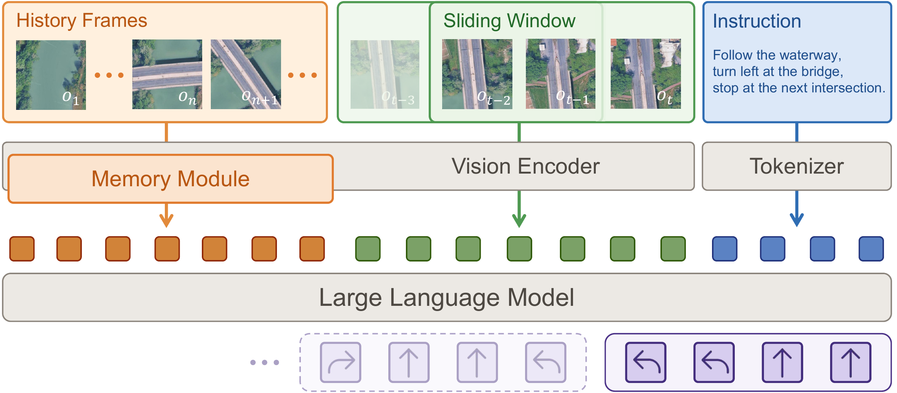
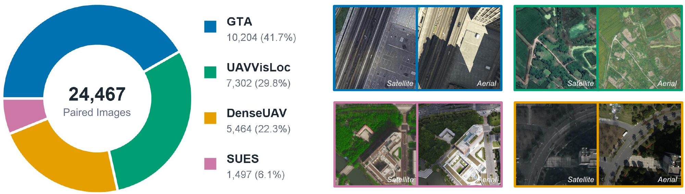

<h1 align="center">SwiftVLN</h1>

<h2 align="center">
  SatNav: A Scalable Benchmark for Long-Horizon UAV Vision-Language Navigation from Satellite Imagery
</h2>

<p align="center">
  <strong>NeurIPS 2026 E&amp;D</strong>
</p>

<p align="center">
  <a href="https://eku127.github.io/">Jiajun Jiang</a><sup>1,*</sup> &nbsp; <a href="mailto:chua183@connect.hkust-gz.edu.cn">Chunliang Hua</a><sup>1,*</sup> &nbsp;
  <a href="mailto:chenzichun@idea.edu.cn">Zichun Chen</a><sup>2</sup> &nbsp; <a href="mailto:wuyanxing@idea.edu.cn">Yanxing Wu</a><sup>2</sup><br>
  <a href="mailto:yangzeyuan@idea.edu.cn">Zeyuan Yang</a><sup>2</sup> &nbsp; <a href="https://facultyprofiles.hkust-gz.edu.cn/faculty-personal-page/SONG-Jie/jsongroas">Jie Song</a><sup>1,3</sup> &nbsp;
  <a href="https://github.com/xiahaa">Xiao Hu</a><sup>1,2,†</sup>
</p>

<p align="center">
  <sup>1</sup> HKUST(GZ) &nbsp;&nbsp;
  <sup>2</sup> LASER, IDEA &nbsp;&nbsp;
  <sup>3</sup> HKUST
</p>

<p align="center">
  <a href="https://openreview.net/forum?id=hOEniyN6hl"></a>
  <a href="https://eku127.github.io/SwiftVLN/wiki/zh-CN/index.html"></a>
  <a href="https://huggingface.co/datasets/Eku127/SatNav-Episodes-v0.1"></a>
  <a href="https://huggingface.co/collections/Eku127/swiftvln-satnav-ablation-model-zoo"></a>
</p>

<p align="center">
  <a href="README.md">English</a> &nbsp;|&nbsp; 简体中文
</p>

<p align="center">
  <a href="docs/assets/readme/swiftvln-framework.png">
    
  </a>
</p>

<p align="center">
  <em>结合滑动对话窗口与可切换的长期记忆，执行长程导航指令。</em>
</p>

SwiftVLN 将轨迹训练、记忆机制实验与在线评测整合到同一框架中。它基于 **ms-swift**，支持 **Qwen2.5-VL 和 Qwen3-VL**，可用于 **SatNav 航空导航**与 **Habitat 室内导航**。

SwiftVLN 随论文 [*SatNav: A Scalable Benchmark for Long-Horizon UAV Vision-Language Navigation from Satellite Imagery*](https://openreview.net/forum?id=hOEniyN6hl) 提出，通过统一的训练与评测流程，研究视觉历史、空间线索和记忆压缩对导航行为的影响。

## 快速开始

**使用已发布的 SwiftVLN 3B 参考模型评测一条 SatNav Episode。** 该流程需要 CUDA GPU、`swiftvln-eval` 环境、训练好的 checkpoint、评测 Episode 及对应的 GeoTIFF 场景。以下命令在仓库根目录的 Bash 中执行。

克隆仓库并初始化 SatNav 评测所需的依赖：

```bash
git clone https://github.com/Eku127/SwiftVLN.git
cd SwiftVLN
export SWIFTVLN_ROOT="${PWD}"
git submodule update --init third_party/ms-swift third_party/SatNav

mkdir -p .local
cp local.env.example .local/env.sh
```

按照[安装指南](docs/zh-CN/getting-started/INSTALLATION.md)创建环境，准备[评测数据](docs/zh-CN/data/EVALUATION_DATA.md)，然后在 `.local/env.sh` 中填写 Conda、SatNav 源码、Episode 和场景路径。

激活环境并下载参考 checkpoint：

```bash
source .local/env.sh
source "${SWIFTVLN_CONDA_SH}"
conda activate swiftvln-eval
python -m pip install --upgrade huggingface_hub

export MODEL_NAME=swiftvln-satnav-3b-1ep-f32s4-overlap0-pf-h8-pool-s2-noembed
export MODEL_PATH="${SWIFTVLN_ROOT}/output/model_zoo/swiftvln/HF_model/${MODEL_NAME}"
hf download "Eku127/${MODEL_NAME}" --local-dir "${MODEL_PATH}"
```

使用第一张 GPU 运行一条 Episode：

```bash
EVAL_SPLIT=val_seen \
CUDA_DEVICES=0 \
MAX_EPISODES=1 \
bash scripts/eval/eval_by_name.sh "${MODEL_NAME}"
```

评测器会执行在线导航，写入逐 Episode 结果和 `evaluation_summary.json`。完整 split、多 GPU、断点续跑与视频输出的配置见[评测指南](docs/zh-CN/evaluation/README.md)。

训练自己的模型时，按照[训练指南](docs/zh-CN/training/README.md)准备 `swiftvln-train` 环境与离线专家轨迹。SatNav 和 Habitat 共用 `scripts/train/train_swiftvln_qwen_vl.sh` 训练入口。

## 长程导航中的记忆机制

SwiftVLN 用**滑动对话窗口**保存近期图像与动作轮次，用**长期记忆**表示更早的观测。窗口重叠在对话推进时保留近期上下文，记忆模块则决定模型能够继续访问哪些历史信息。

| 组件 | 可比较的配置 |
| --- | --- |
| 对话窗口 | 窗口长度、每次预测的动作数、相邻窗口的重叠范围 |
| 历史采样 | 均匀采样、随机采样、偏向近期观测的采样 |
| 逐帧记忆 | 对各历史帧进行空间池化或 GridToMe 压缩 |
| Token 聚类 | 全局 Token 聚类 GTC，或按时间分段的 Segment-GTC（`sgtc`，论文中称 STC） |
| 地图记忆 | 面向 SatNav 的全局与局部地图表示 |
| 输入增强 | 初始帧提示、相对位姿线索与视觉 embedding 增强 |

参考配置使用 **32 个动作的窗口**、**每次预测 4 个动作**，以及 **8 个均匀采样并逐帧池化的历史观测**。实验命令见[记忆配置](docs/zh-CN/training/MEMORY.md)，实现说明见[代码架构](docs/zh-CN/development/ARCHITECTURE.md)。

## 数据集与模型库

卫星图像导航使用 [SatNav-Episodes-v0.1](https://huggingface.co/datasets/Eku127/SatNav-Episodes-v0.1)，室内导航使用 Habitat 轨迹。训练读取离线 RGB 观测与专家动作；在线评测使用 Episode、场景和模型 checkpoint。

| 资源 | 入口 |
| --- | --- |
| SatNav Episode 与数据划分 | [Hugging Face 下载](https://huggingface.co/datasets/Eku127/SatNav-Episodes-v0.1) |
| SatNav 场景与训练轨迹 | [SatNav 数据准备](docs/zh-CN/data/TRAINING_DATA_SATNAV.md) |
| Habitat R2R、RxR 与 EnvDrop 训练轨迹 | [Habitat 数据准备](docs/zh-CN/data/TRAINING_DATA_HABITAT.md) |
| SatNav 与 Habitat 评测资源 | [评测数据](docs/zh-CN/data/EVALUATION_DATA.md) |
| 记忆消融实验 checkpoint | [SwiftVLN SatNav Ablation Model Zoo](https://huggingface.co/collections/Eku127/swiftvln-satnav-ablation-model-zoo) |

采用参考记忆配置的已发布 SatNav 模型：

| Backbone | Checkpoint | 用途 |
| --- | --- | --- |
| Qwen2.5-VL 3B | [下载](https://huggingface.co/Eku127/swiftvln-satnav-3b-1ep-f32s4-overlap0-pf-h8-pool-s2-noembed) | 默认参考模型 |
| Qwen2.5-VL 7B | [下载](https://huggingface.co/Eku127/swiftvln-satnav-7b-1ep-f32s4-overlap0-pf-h8-pool-s2-noembed) | Backbone 对比 |
| Qwen3-VL 2B | [下载](https://huggingface.co/Eku127/swiftvln-satnav-qwen3vl-2b-1ep-f32s4-overlap0-pf-h8-pool-s2-noembed) | Backbone 对比 |
| Qwen3-VL 8B | [下载](https://huggingface.co/Eku127/swiftvln-satnav-qwen3vl-8b-1ep-f32s4-overlap0-pf-h8-pool-s2-noembed) | Backbone 对比 |

下载命令、完整消融模型列表与模型命名规则见[模型与 Checkpoint](docs/zh-CN/getting-started/CHECKPOINTS.md)。

## 从卫星图像到无人机观测

Satellite-to-UAV adapter 将无人机视觉 token 映射到冻结视觉编码器的卫星特征空间。训练使用卫星—无人机配对图像，结合对比损失与余弦对齐损失；推理时通过 adapter 将无人机观测接入在 SatNav 上训练的导航模型。

<p align="center">
  <a href="docs/assets/readme/satellite-uav-pairs.png">
    
  </a>
</p>

<p align="center">
  <em>论文迁移实验所用的卫星与无人机配对图像。</em>
</p>

按照 [SatDronePair 数据生成](docs/zh-CN/data/SATDRONEPAIR.md)准备四个来源的数据，再参考 [Satellite-to-UAV Stage-A 训练](docs/zh-CN/training/S2R_STAGE_A.md)完成 adapter 的训练与评测。

## Wiki

访问 **[SwiftVLN Wiki](https://eku127.github.io/SwiftVLN/wiki/zh-CN/index.html)**，阅读实现原理、记忆机制图解，以及训练和评测指南。

| 我想要…… | 文档 |
| --- | --- |
| 理解实现原理 | [双层记忆与滑窗](https://eku127.github.io/SwiftVLN/wiki/zh-CN/concepts/PIPELINE.html) · [记忆压缩](https://eku127.github.io/SwiftVLN/wiki/zh-CN/concepts/MEMORY.html) · [地图记忆](https://eku127.github.io/SwiftVLN/wiki/zh-CN/concepts/MAP_MEMORY.html) · [输入增强](https://eku127.github.io/SwiftVLN/wiki/zh-CN/concepts/AUGMENTATION.html) |
| 安装 SwiftVLN 并加载 checkpoint | [安装](https://eku127.github.io/SwiftVLN/wiki/zh-CN/getting-started/INSTALLATION.html) · [模型与 Checkpoint](https://eku127.github.io/SwiftVLN/wiki/zh-CN/getting-started/CHECKPOINTS.html) |
| 准备训练或评测数据 | [SatNav](https://eku127.github.io/SwiftVLN/wiki/zh-CN/data/TRAINING_DATA_SATNAV.html) · [Habitat](https://eku127.github.io/SwiftVLN/wiki/zh-CN/data/TRAINING_DATA_HABITAT.html) · [评测数据](https://eku127.github.io/SwiftVLN/wiki/zh-CN/data/EVALUATION_DATA.html) |
| 训练或评测导航模型 | [训练](https://eku127.github.io/SwiftVLN/wiki/zh-CN/training/README.html) · [评测](https://eku127.github.io/SwiftVLN/wiki/zh-CN/evaluation/README.html) |
| 比较记忆机制 | [记忆配置](https://eku127.github.io/SwiftVLN/wiki/zh-CN/training/MEMORY.html) |
| 将卫星特征迁移到无人机观测 | [SatDronePair](https://eku127.github.io/SwiftVLN/wiki/zh-CN/data/SATDRONEPAIR.html) · [Stage-A 训练](https://eku127.github.io/SwiftVLN/wiki/zh-CN/training/S2R_STAGE_A.html) |
| 增加模型、记忆模块或环境 | [代码架构](https://eku127.github.io/SwiftVLN/wiki/zh-CN/development/ARCHITECTURE.html) · [扩展 SwiftVLN](https://eku127.github.io/SwiftVLN/wiki/zh-CN/development/EXTENDING.html) |

完整 Wiki 支持 [English](https://eku127.github.io/SwiftVLN/wiki/en-US/index.html) 和[简体中文](https://eku127.github.io/SwiftVLN/wiki/zh-CN/index.html)。

<details>
<summary><strong>仓库结构</strong></summary>

```text
src/swiftvln/  模型、记忆、训练、环境 backend 与在线评测
scripts/      训练、评测与任务队列入口
tools/s2r/    SatDronePair 数据准备与 Satellite-to-UAV 工具
environments/ 独立的训练和评测 Conda 环境
third_party/  固定版本的 ms-swift、SatNav 与 Habitat-Lab 源码
docs/         中英文文档与共享配图
```

</details>

## 致谢

SwiftVLN 基于 [ms-swift](https://github.com/modelscope/ms-swift) 和 [Qwen-VL](https://github.com/QwenLM/Qwen3-VL) 模型系列构建。训练与评测设计借鉴了 [StreamVLN](https://github.com/InternRobotics/StreamVLN)，包括短期对话上下文与长期视觉记忆的组织方式。

感谢 [SatNav](https://github.com/Eku127/SatNav) 和 [Habitat-Lab](https://github.com/facebookresearch/habitat-lab) 提供导航环境，以及 DenseUAV、GTA-UAV、SUES-200 和 UAV-VisLoc 团队提供 Satellite-to-UAV 迁移所用的数据。数据来源与准备步骤见 [SatDronePair 指南](docs/zh-CN/data/SATDRONEPAIR.md)。
