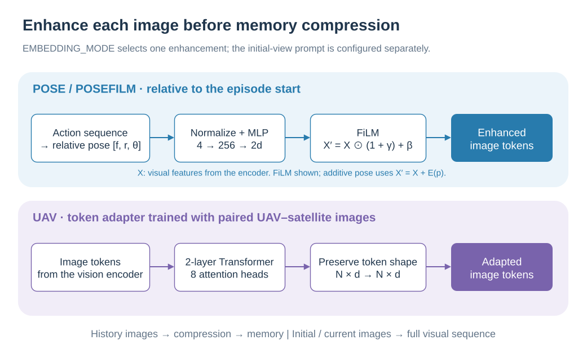

# Input augmentation: initial view, pose, and UAV adaptation

[简体中文](../../zh-CN/concepts/AUGMENTATION.md) | English

Memory compression determines how much historical information is retained. Input augmentation determines what information each image carries. SwiftVLN can preserve the initial view in the system prompt and augment visual features with relative pose or UAV domain adaptation. Launch settings are covered in [memory configuration](../training/MEMORY.md) and [Stage-A training](../training/S2R_STAGE_A.md).

## 1. The initial view as a fixed visual reference

`SYSTEM_PROMPT_SETTING=initial` adds the episode's first image to every window's system prompt. It retains the full visual token sequence: 256 tokens in the reference Qwen2.5-VL setting. History sampling runs independently, so the initial image can also appear in compressed history.

The initial view preserves starting-scene detail that helps connect the current view to the departure point. Online inference encodes it once at episode start as `initial_features` and injects it again in later windows. The template uses the full-image `<image>` → `<current_image>` path.

## 2. Constructing relative pose

Pose is relative to the episode's initial position and heading. Let $f$ be displacement along the initial forward axis, $r$ displacement along its right axis, and $\theta$ relative heading. A forward action of length $\ell$ updates:

$$
f\leftarrow f+\ell\cos\theta,\qquad
r\leftarrow r+\ell\sin\theta.
$$

Right turns increase $\theta$ and left turns decrease it, using the selected environment's turn angle. Training integrates expert actions; evaluation integrates executed actions. Each episode starts with zero displacement and zero relative heading, aligning the pose source across both pipelines.

The enhancement module transforms each image's pose into:

$$
p_i=[\tanh(f_i/s),\tanh(r_i/s),\sin\theta_i,\cos\theta_i],
\qquad s=100\ \text{m by default}.
$$

Translation normalization bounds the input values. Sine and cosine provide a continuous heading representation across angle wraparound. Displacements come from discrete action integration, whose accuracy depends on agreement between the action model and actual movement.

## 3. How FiLM modifies visual tokens

`EMBEDDING_MODE=posefilm` selects FiLM pose enhancement. A two-layer MLP, `Linear(4,256) → GELU → Linear(256,2d)`, produces channel-wise scale and bias:

$$
[\gamma_i,\beta_i]=\operatorname{MLP}(p_i),\qquad
X'_i=X_i\odot(1+\gamma_i)+\beta_i.
$$

$X_i\in\mathbb R^{n_i\times d}$ contains one image's tokens. The same $\gamma_i,\beta_i$ are broadcast over all its tokens, letting relative position and heading modulate visual channels. The final linear layer's weights and bias start at zero, so initially $X'_i=X_i$.

The code also supports `EMBEDDING_MODE=pose`, which predicts a $d$-dimensional vector and adds it to every image token. The module's `beta` argument is an additional fusion strength, defaulting to 1. The formula above uses that default; FiLM's offset is named `bias` in the code.

Enhancement runs before history compression and applies to historical, initial, and current images:

  

The colored branches are alternative enhancement modes. FiLM is shown with its default fusion strength of 1.

Thus, features already carry pose information when a subsequent GTC operation combines tokens from multiple times.

## 4. Stage-A alignment from UAV features to satellite features

The paper uses 24,467 UAV–satellite pairs aligned in viewing extent and orientation: 21,216 training pairs and 3,251 validation pairs. A frozen Qwen2.5-VL vision encoder $f$ processes both images:

$$
U_i=f(x_i^u),\quad S_i=f(x_i^s),\quad \widetilde U_i=A_\phi(U_i).
$$

The UAV branch passes through a trainable adapter, while satellite features provide the target. The adapter preserves token count and feature dimension. Its defaults are two Transformer layers, eight attention heads per layer, MLP expansion ratio 4, and dropout 0. Each layer uses pre-normalization, self-attention, residual connections, and an MLP, followed by a final LayerNorm after the stack.

Masked mean pooling handles variable-length visual sequences and produces $\bar u_i$ and $\bar s_i$. Two losses constrain the original feature space and a shared projection space.

**Cosine loss** directly aligns pooled UAV and satellite features:

$$
\mathcal L_{\mathrm{cos}}=\frac1B\sum_i
\left(1-\cos(\bar u_i,\bar s_i)\right).
$$

**Bidirectional contrastive loss** first applies a shared projection head $P_\psi$ and L2 normalization to obtain $z_i^u,z_i^s$. The UAV-to-satellite direction is:

$$
\mathcal L_{u\to s}=-\frac1B\sum_i\log
\frac{\exp((z_i^u)^\top z_i^s/\tau)}
{\sum_j\exp((z_i^u)^\top z_j^s/\tau)}.
$$

Swapping the domains gives $\mathcal L_{s\to u}$, and the objective is:

$$
\mathcal L=\tfrac12(\mathcal L_{u\to s}+\mathcal L_{s\to u})+
\mathcal L_{\mathrm{cos}}.
$$

The contrastive term distinguishes corresponding locations within a batch of candidates. The cosine term directly constrains the original satellite feature space. Stage-A optimizes only the adapter and projection head. Validation reports bidirectional Recall@1/5/10 and paired cosine similarity; the best checkpoint maximizes UAV-to-satellite Recall@1.

## 5. Connecting the adapter to navigation

The navigation loader reconstructs the adapter from `adapter_kwargs` and `adapter_state_dict`, inserting it after the vision encoder and before history compression. Navigation uses adapted token features. The Stage-A projection head serves contrastive training; the navigation loader reads the adapter portion.

The current `UAVAdapterEnhancement` supports `apply_scope=all_images`. When selected, historical, initial, and current images all pass through the adapter. Their image domain follows the dataset and deployment workflow. `EMBEDDING_MODE` selects one of `none`, `pose`, `posefilm`, or `uav`; the initial view is controlled independently through the prompt setting.

`EmbeddingEnhancementPipeline` registers its modules through `nn.ModuleDict`, so their parameters enter the model `state_dict` and can be saved and restored with navigation checkpoints.

## 6. Code and paper references

| Component | Implementation |
| --- | --- |
| Relative pose integration | [`reconstruct_pose_from_actions`](../../../src/swiftvln/modeling/embeddings/pose_utils.py) |
| Normalization, MLP, FiLM, and zero initialization | [`PoseEmbedding`](../../../src/swiftvln/modeling/embeddings/pose_embed.py) |
| Enhancement registration and execution | [`EmbeddingEnhancementPipeline`](../../../src/swiftvln/modeling/embeddings/pipeline.py) |
| Transformer adapter | [`Sim2RealAdapter`](../../../src/swiftvln/modeling/embeddings/s2r_adapter.py) |
| Frozen visual encoder and projection head | [`tools/s2r/model.py`](../../../tools/s2r/model.py) |
| Contrastive and cosine losses | [`tools/s2r/losses.py`](../../../tools/s2r/losses.py) |
| Stage-A optimization | [`tools/s2r/trainer.py`](../../../tools/s2r/trainer.py) |
| Navigation checkpoint integration | [`UAVAdapterEnhancement`](../../../src/swiftvln/modeling/embeddings/uav_adapter.py) |

Paper source: [SatNav paper](https://openreview.net/forum?id=hOEniyN6hl), **Memory Design Details → Initial Frame Prompting / Pose Encoding** and **Satellite-to-UAV Adapter Details**.
