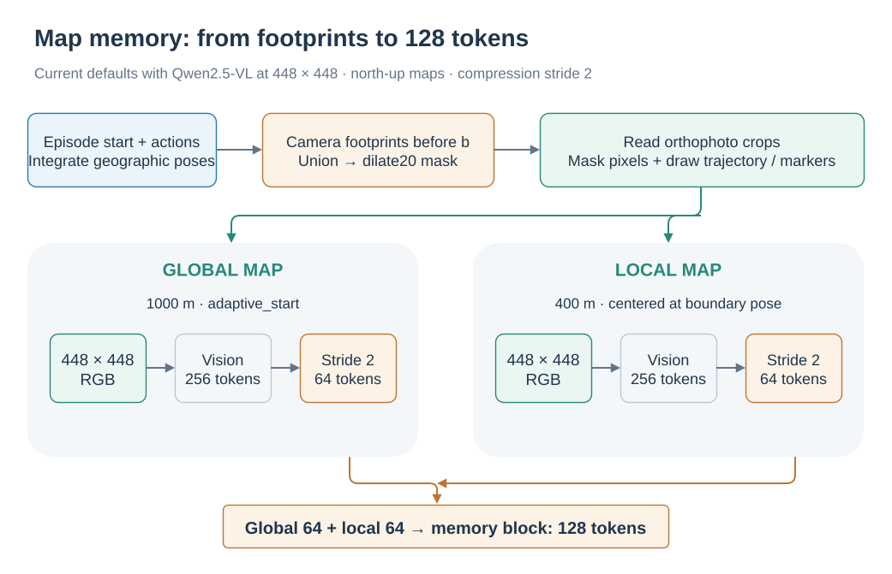

# Map memory: encoding explored space as visual context

[简体中文](../../zh-CN/concepts/MAP_MEMORY.md) | English

Map memory represents pre-window spatial experience with two north-up maps. A global map provides large-scale route context; a local map shows detail around the window start. Both pass through the same vision encoder as current observations and populate `<history_memory>`. They follow the same [window-boundary update schedule](PIPELINE.md) as other long-term memories.

  

The two maps share the vision encoder, are pooled separately, and are concatenated as historical memory.

## 1. Turning a trajectory into two maps

Rendering uses the SatNav scene orthophoto, episode start coordinates and heading, executed actions, camera field of view, and altitude:

1. Convert the start to Web Mercator coordinates and integrate forward steps and turns into a pose sequence.
2. For a new window starting at $b$, use poses with indices below $b$ to define observed space. The trajectory polyline includes the position at the boundary.
3. Compute each observation's ground-footprint polygon from altitude, horizontal field of view, aspect ratio, and heading. Combine the footprints into a mask.
4. Read square global and local crops from the orthophoto and set pixels outside the mask to black.
5. Draw the trajectory in red, start in blue, and current position and heading in yellow. Return `[global_map, local_map]`.

For a downward-facing camera, footprint width is $2h\tan(\mathrm{HFOV}/2)$; image aspect ratio determines footprint height. Geographic conversion includes the latitude-dependent Mercator scale so map side lengths remain ground distances in meters.

The current position in this memory is the new window's starting position. The map remains that snapshot while actions execute within the window, until the next slide.

## 2. Global view, local view, and explored mask

| Component | Current default | Role |
| --- | --- | --- |
| Global map | 1000 m side length | Overall route and starting-area relationships |
| Local map | 400 m side length, centered at the window start | Nearby spatial detail |
| Render resolution | 448 × 448 for each map | Fixed input image size |
| `strict` mask | Union of observed camera footprints | Show footprint-covered pixels |
| `dilate20` mask | Expand the footprint mask by approximately 20 m | Also show imagery around observation boundaries |

Dilation uses a pixel maximum filter with radius approximately `round(20 / side_m * render_px)`. The same 20 m therefore corresponds to different pixel radii in global and local views.

The current `SatNavMapMemoryBuilder` defaults to `adaptive_start`: it anchors the view at the start and shifts the fixed-size crop as trajectory and observation bounds approach its edges. It uses a 10% edge margin and 25 m shift quantization. The class also supports a fixed `start` mode. Both maps remain north-up; the yellow arrow expresses heading separately.

At the first window, $b=0$, there are no historical footprints. The background is black and start/current markers are still drawn. Later windows accumulate explored space.

## 3. Global and local map examples

  
  

London-2: global view on the left, local view on the right. Blue marks the start, yellow marks position and heading at the window boundary, and red marks the trajectory. Images are from the paper&#x27;s Map Memory appendix example.

  
  

NewYork-1: global map on the left and local map on the right. Together with London-2 above, this illustrates explored coverage along different routes. Images are from the paper appendix.

A shared geographic frame brings route shape, revisited areas, and the relationship between start and current position into one image. Representation quality depends on action integration, scene imagery, and geographic alignment. The current implementation uses SatNav, which supplies these inputs.

## 4. How maps become memory tokens

During training, the dataset renders maps and places them in the history portion of `images`. During evaluation, `_compute_history_cache_map()` renders and encodes them. Both paths then apply per-frame compression and concatenate global-map tokens followed by local-map tokens.

The current default is `COMPRESS_STRIDE=2`. For Qwen2.5-VL with 448 × 448 inputs, each map produces 256 visual tokens and is further pooled to 64. Concatenating the global map followed by the local map produces a 128-token memory block.

| Compression setting | Encoded tokens per map | Pooled tokens per map | Total for two maps |
| --- | --- | --- | --- |
| Default `COMPRESS_STRIDE=2` | $16\times16=256$ | $8\times8=64$ | 128 |
| `COMPRESS_STRIDE=1` | $16\times16=256$ | 256 | 512 |

For other image sizes or backbones, counts follow the actual `image_grid_thw` and `merge_size`. Stride controls the tradeoff between map detail and LLM context cost: a smaller stride retains a denser visual grid and more input tokens. See [memory configuration](../training/MEMORY.md) for launch parameters.

## 5. Rendering caches and code entry points

A disk cache can reuse rendered maps for the same trajectory prefix and rendering configuration. Online inference separately keeps encoded map tokens for reuse within a window. The disk cache saves orthophoto reads and rendering; the token cache saves repeated visual encoding.

| Component | Implementation |
| --- | --- |
| Defaults and builder composition | [`SatNavMapMemoryBuilder`](../../../src/swiftvln/modeling/memory/satnav_map.py) |
| Action integration, footprints, and image crops | [`MapGeometryMixin`](../../../src/swiftvln/modeling/memory/geometry.py) |
| Masks, crop centers, and trajectory drawing | [`MapRenderMixin`](../../../src/swiftvln/modeling/memory/render.py) |
| Training scene and episode metadata | [`metadata.py`](../../../src/swiftvln/modeling/memory/metadata.py) |
| Disk image cache | [`MapCacheMixin`](../../../src/swiftvln/modeling/memory/cache.py) |
| Online encoding and pooling | [`_compute_history_cache_map`](../../../src/swiftvln/evaluation/inference/encoding.py) |

Paper source: [SatNav paper](https://arxiv.org/abs/2609.31507), **Memory Design Details → Map Memory**. Image provenance is recorded in the [asset notes](https://github.com/Eku127/SwiftVLN/blob/master/docs/assets/concepts/README.md).
