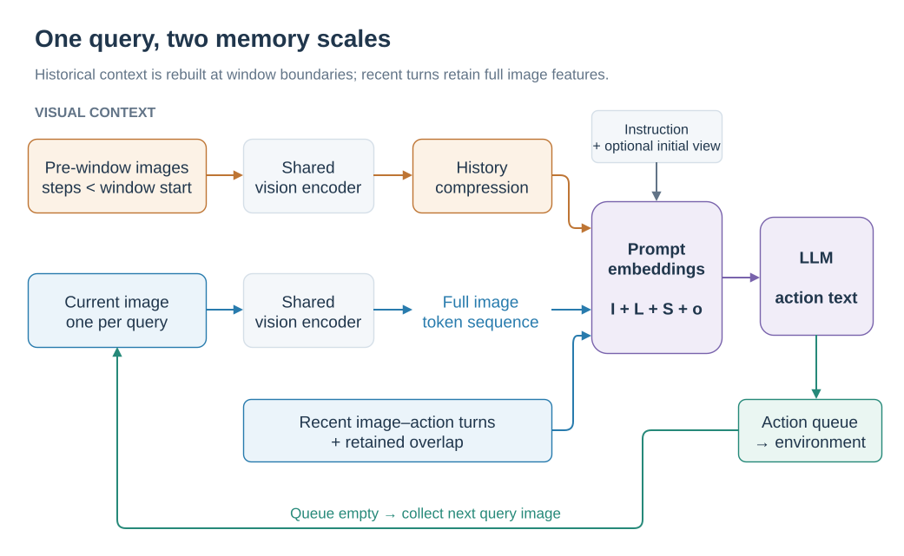
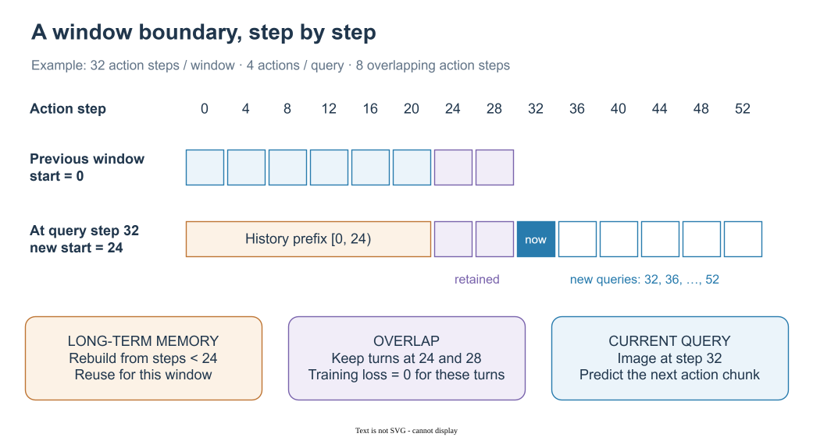

# From observations to actions: dual memory and sliding windows

[简体中文](../../zh-CN/concepts/PIPELINE.md) | English

SwiftVLN represents a navigation trajectory as a visual dialogue. Each query receives the current image and produces a sequence of navigation actions. Short-term memory retains recent image–response turns; long-term memory compresses observations before the window into visual tokens. The language model receives both memories together with the instruction.

This chapter explains queries, memory updates, and supervision from the current code, with the paper appendix as method background. Continue with [history sampling and compression](MEMORY.md), [map memory](MAP_MEMORY.md), and [input augmentation and domain adaptation](AUGMENTATION.md). Launch settings are covered in the [training guide](../training/README.md).

## 1. What enters one model query

Let $t$ index model queries, $\mathcal I$ denote the instruction, $o_t$ the current image, $S_t$ the completed image–action turns in the window, and $L_t$ the long-term memory:

$$
C_t=\Phi(\mathcal I,L_t,S_t,o_t),\qquad Y_t=f_\theta(C_t).
$$

For example, `↑↑→↑` is parsed into forward, forward, right, forward. The environment executes these actions in sequence and requests another prediction when the queue becomes empty. Training supplies expert action text; online evaluation adds the model's generated responses to subsequent context.

  

*Orange shows pre-window history, blue shows recent visual context, and green shows environment execution.*

Long-term memory appears in the system prompt. Short-term memory consists of user/assistant messages. Current images keep the full token sequence produced by the vision encoder; historical images undergo additional compression. With Qwen2.5-VL, 448 × 448 inputs, and the default compression stride of 2, each image produces 256 visual tokens and each sampled history frame is reduced to 64.

## 2. Action steps versus query rounds

The code measures `NUM_FRAMES` and `NUM_OVERLAP` in action steps. For chunks of $k$ actions:

$$
N_w=\frac{W}{k},\qquad
N_o=\frac{O}{k},\qquad
d=W-O.
$$

$W$ is `NUM_FRAMES` and $O$ is `NUM_OVERLAP`. $N_w$ is the number of turns per window, $N_o$ the overlap in turns, and $d$ the advance of the window start in action steps. Settings align to complete action chunks.

| Setting | Code parameters | Dialogue interpretation |
| --- | --- | --- |
| Default window | `NUM_FRAMES=32`, `NUM_FUTURE_STEPS=4` | 8 turns, each supervising 4 actions |
| Default overlap | `NUM_OVERLAP=0` | Start a new window every 32 actions |
| Two overlapping turns | `NUM_OVERLAP=8` | Retain 2 turns; advance the start by 24 steps |
| Four overlapping turns | `NUM_OVERLAP=16` | Retain 4 turns; advance the start by 16 steps |

  

*Empty blue boxes mark later queries in the new window; the two purple turns remain full context.*

With two overlapping turns, the first window queries at action steps `0,4,…,28`. At step 32, the new window starts at 24. It retains the images and responses from steps 24 and 28, builds long-term memory from observations before step 24, and uses the image at step 32 for the current query. Overlap preserves detailed context around the boundary while long-term memory carries earlier information.

Online evaluation checks boundaries against executed action steps and slides when the action queue is empty. The default training target contains four actions per turn; actual execution length follows the parsed response and episode termination.

## 3. When long-term memory changes

For a new window starting at $b$, the historical range is $[0,b)$. Memory is constructed at the slide and reused by subsequent queries in that window:

$$
L_{t+1}=\begin{cases}
\mathcal M(\mathcal H_{<b}), & \text{when the window slides},\\
L_t, & \text{for further queries within the window}.
\end{cases}
$$

Frame sampling selects again from the complete pre-window trajectory. GTC/STC cluster the original cached features of pre-window query frames again. Previously aggregated memory tokens are therefore not the sole input to the next clustering operation. Each episode resets the window, history, initial image, and feature caches.

| State | Stored information | Update time |
| --- | --- | --- |
| `window_turns` / `overlap_context` | Image features, user tokens, assistant action text | Append after each query; retain trailing turns at a slide |
| `history_cache` | Compressed memory ready for prompt injection | Rebuild for a new window |
| `vit_feature_cache` | Encoded GTC/STC query frames, keyed by action step | Add after each query; clear between episodes |

A fixed memory output budget bounds the historical tokens passed to the LLM. The original GTC/STC feature cache grows with the number of queries, and later clustering processes more historical input.

## 4. How visual tokens enter the LLM

Training samples order `images` as history images, optional initial image, then window images. `num_history_images`, `num_initial_images`, and `frame_poses` identify each image's role.

The template handles visual inputs in two stages:

1. `_encode()` computes output lengths from image grids and the history processor. It expands `<history_memory>` to the number of placeholders required by the memory block and each `<current_image>` to that image's full visual token count.
2. `_post_encode()` runs the vision encoder, applies optional per-image enhancement, compresses history features, and writes the resulting vectors into the placeholder positions in `inputs_embeds`.

Thus, one `<history_memory>` marker in the prompt source can represent 512 embedding positions in the LLM input. Initial and current images share the `<current_image>` path; the initial view is injected through this shared path.

During evaluation, `PromptConstructionMixin` directly assembles an embedding sequence with the same semantic roles before calling `model.generate()`. The complete window is assembled for every query. `generate(use_cache=True)` enables caching within that generation call; persistent state across queries consists of the image and dialogue data listed above.

## 5. How training matches windowed evaluation

`SwiftVLNDataset` samples expert-trajectory windows with stride $d$. It takes a current image every `NUM_FUTURE_STEPS` steps and converts the following action chunk to an assistant response. For overlapping windows starting after step zero, the first $N_o$ assistant responses receive `loss=0.0`. These responses remain attention context, while new responses supply supervision.

The autoregressive action-text objective can be written as:

$$
\mathcal L_{\mathrm{SFT}}=-\sum_{j\in\mathcal T_{\mathrm{new}}}
\log p_\theta(y_j\mid C,y_{<j}),
$$

where $\mathcal T_{\mathrm{new}}$ contains supervised tokens from new responses. Training context follows expert trajectories; evaluation context follows executed actions and the model's previous responses.

## 6. Code reading guide

| Question | Implementation |
| --- | --- |
| How are windows, messages, and overlap loss masks created? | [`SwiftVLNDataset.__getitem__`](../../../src/swiftvln/training/sft/dataset.py) |
| How are placeholders allocated and filled? | [`SwiftVLNTemplate._encode / _post_encode`](../../../src/swiftvln/modeling/template.py) |
| When does the system query, slide, and execute? | [`EnvironmentEpisodeLoop.run`](../../../src/swiftvln/evaluation/episode_loop.py) |
| How are overlapping turns and history rebuilt? | [`WindowStateMixin.slide_window`](../../../src/swiftvln/evaluation/inference/window.py) |
| How is the complete context assembled? | [`PromptConstructionMixin`](../../../src/swiftvln/evaluation/inference/prompt.py) |
| How are predictions and query frames saved? | [`SwiftVLNInferenceSession.predict`](../../../src/swiftvln/evaluation/inference/session.py) |

Paper source: [SatNav paper](https://openreview.net/forum?id=hOEniyN6hl), **SwiftVLN Framework Details → Overall Pipeline / Prompt Construction**. This implementation guide was checked against code revision [`7984ed6`](https://github.com/Eku127/SwiftVLN/tree/7984ed6fa053e8cba1648c16d0ae7944c8eba25d).
