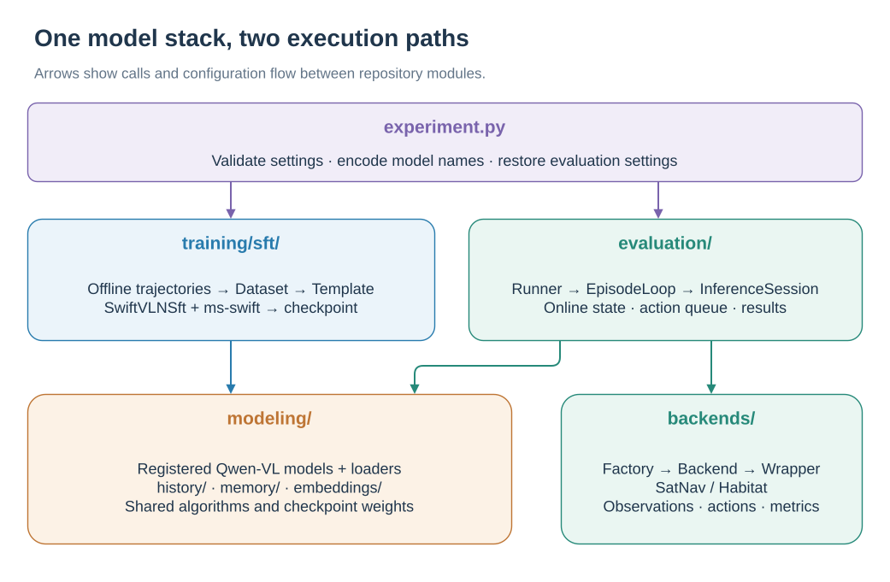
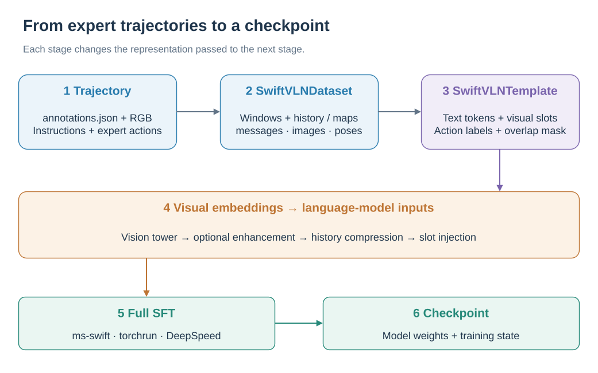
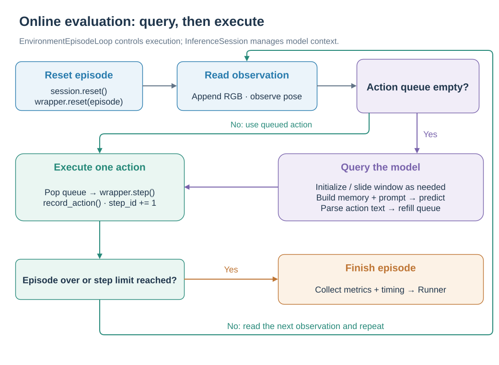
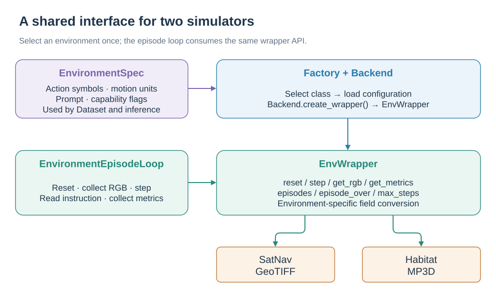
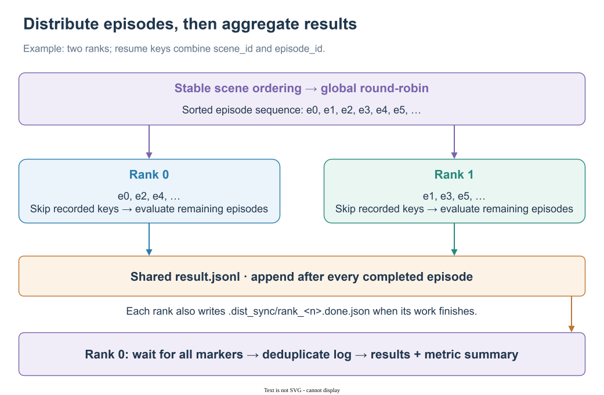

# Architecture

[简体中文](../../zh-CN/development/ARCHITECTURE.md) | English

See [dual memory and sliding windows](../concepts/PIPELINE.md) for the end-to-end data flow and training objective, and [historical memory and token compression](../concepts/MEMORY.md) for the memory algorithms.

SwiftVLN separates training, online evaluation, model extensions, and simulator adapters into independent modules. Training reads offline trajectories, while evaluation connects to SatNav or Habitat through a Backend. Both pipelines share the model, Memory processing, embedding enhancements, and experiment configuration.

<p align="center">
  <a href="../../assets/workflows/architecture.en-US.svg"></a>
</p>

*Training and evaluation call shared modeling components; the evaluation path also connects to simulator backends.* · [Editable draw.io source](../../assets/workflows/architecture.en-US.drawio)

## 1. Repository structure

```text
SwiftVLN/
├── src/swiftvln/
│   ├── experiment.py          # Experiment constraints and model-name codec
│   ├── training/sft/          # Training arguments, Dataset, and ms-swift trainer
│   ├── modeling/              # Models, Template, Memory, and embeddings
│   ├── evaluation/            # Online evaluation, inference state, and result persistence
│   ├── backends/              # SatNav / Habitat adapters
│   ├── data/                  # Habitat trajectory generation and validation CLI
│   ├── configs/               # Packaged evaluation task configurations
│   └── utils/                 # Distributed, image, and video utilities
├── scripts/
│   ├── train/                 # Training launchers
│   ├── eval/                  # Evaluation launchers
│   ├── queue/                 # File-based queues
│   └── lib/                   # Shared shell functions
├── tools/s2r/                 # SatDronePair and Satellite-to-UAV Stage-A tools
├── environments/             # swiftvln-train / swiftvln-eval environment definitions
├── third_party/               # Pinned external source trees
└── docs/                      # User and development documentation
```

`src/swiftvln` is the installable Python package. Shell launchers, offline Satellite-to-UAV tools, and documentation are repository-level assets and are not part of the core package.

## 2. Configuration and model name

[`experiment.py`](../../../src/swiftvln/experiment.py) defines `SwiftVLNExperimentSpec`, the source of truth for:

- Environment and model families;
- Trajectory window, future steps and overlap;
- Memory method and history processor;
- system prompt and embedding enhancement;
- Map memory environment and parameter constraints;
- Model name generation, parsing and shell/JSON output.

The training script calls `build-name` before launch. `eval_by_name.sh` uses the same module to parse the model name and restore evaluation parameters:

```text
training variables ──> SwiftVLNExperimentSpec ──> model name
                                                     │
                                                     ▼
evaluation variables <── shell assignments <── parse-name
```

The training parameters and evaluation parameters are respectively defined in:

| Configuration entry point | Location |
| --- | --- |
| Shared experimental constraints |`src/swiftvln/experiment.py`|
| Training parameters |`src/swiftvln/training/sft/arguments.py`|
| Evaluation parameters |`src/swiftvln/evaluation/arguments.py`|
| Training startup default value |`scripts/train/train_swiftvln_qwen_vl.sh`|
| Evaluation startup default value |`scripts/eval/eval_swiftvln_qwen_vl_distributed.sh`|

## 3. Training pipeline

<p align="center">
  <a href="../../assets/workflows/training-flow.en-US.svg"></a>
</p>

*Trajectory windows become multimodal conversations, then embeddings and supervised action labels.* · [Editable draw.io source](../../assets/workflows/training-flow.en-US.drawio)

### 3.1 Dataset

[`training/sft/dataset.py`](../../../src/swiftvln/training/sft/dataset.py) reads one or more trajectory directories containing `annotations.json` and performs the following operations:

- Split trajectories into windows using `NUM_FRAMES` and `NUM_OVERLAP`;
- Organize multi-turn action prediction using `NUM_FUTURE_STEPS`;
- Set loss mask for context assistant turn in overlapping window;
- Sampling historical RGB, or generating SatNav Map memory;
- Construct initial observations and relative poses;
- Output multimodal dialogue samples accepted by ms-swift.

The core fields output by Dataset are:

| Field | Content |
| --- | --- |
|`messages`| System, user image turn and assistant action turn |
|`images`| History, initial observation, current observation, in that order |
|`num_history_images`| Template Number of historical images to be processed |
|`num_initial_images`| Initial number of observations in System prompt |
|`memory_method`|`history` or `map`|
|`frame_poses`| Pose aligned with image sequence when pose enhancement is enabled |

### 3.2 Template

[`modeling/template.py`](../../../src/swiftvln/modeling/template.py)for Qwen2.5-VL and Qwen3-VL registers SwiftVLN Template. Template uses two special tokens:

| Token | Purpose |
| --- | --- |
|`<history_memory>`| Compressed history Memory token block |
|`<current_image>`| Visual token block of Initial/current observation |

During encoding, the Template first computes the placeholder-token count. After vision-tower encoding, it calls the history processor and injects the resulting embeddings into the placeholders. Image order, placeholder count, and visual-embedding count must remain aligned.

### 3.3 Trainer and Checkpoint

[`training/sft/trainer.py`](../../../src/swiftvln/training/sft/trainer.py) extends ms-swift `SwiftSft`. It detects VLN trajectories, creates `SwiftVLNDataset`, configures the Template history processor, and attaches embedding enhancements. ms-swift trains and saves the model, optimizer, scheduler, and enhancement parameters.

## 4. Evaluation pipeline

The runner loads the checkpoint, assigns episodes, and records completed results. Inside each episode, the loop below alternates between model queries and environment actions.

<p align="center">
  <a href="../../assets/workflows/episode-loop.en-US.svg"></a>
</p>

*Only an empty action queue triggers a model query; each environment step executes one queued action.* · [Editable draw.io source](../../assets/workflows/episode-loop.en-US.drawio)

`SwiftVLNInferenceSession` builds prompt tokens, encodes images, and injects embeddings directly. It maintains the online conversation window and memory cache as the simulator advances.

### 4.1 Runner

[`evaluation/runner.py`](../../../src/swiftvln/evaluation/runner.py) handles model loading, distributed initialization, episode allocation, resume, and result aggregation. Episodes are stably sorted by scene and then sharded round-robin.

### 4.2 Episode loop

[`evaluation/episode_loop.py`](../../../src/swiftvln/evaluation/episode_loop.py) handles only the `reset → predict → step → metrics` state machine. Each episode starts with `session.reset()` to clear inference state. The Backend supplies observations, executes actions, and saves video.

### 4.3 Inference session

`evaluation/inference/` Split by responsibility:

| Modules | Responsibilities |
| --- | --- |
|`session.py`| Combined inference parameters, processor, Memory builder and generation entry |
|`prompt.py`| Construct system/user/assistant token and final `inputs_embeds`|
|`encoding.py`| Encode initial/current/history image and build Memory cache |
|`window.py`| Save turn, overlap context, pose and sliding window state |

## 5. Modeling

### 5.1 Model registration

[`modeling/registry.py`](../../../src/swiftvln/modeling/registry.py) uses `register_swiftvln_models()` to register:

- Transformers config and model class;
- ms-swift model metadata and loader;
- Qwen2.5-VL / Qwen3-VL Template；
- SwiftVLN special visual token.

Importing `swiftvln` does not trigger model registration. Training and evaluation entry points call the registration function explicitly before parsing or loading a model.

### 5.2 History processor

`modeling/history/` provides a unified interface:

```text
get_output_token_count(...)  # compute placeholder-token count before encoding
process(...)                 # process visual embeddings
```

Current implementations include per-frame pooling/GridToMe, GTC, and Segment-GTC. Training Template and Online Inference sessions use the same factory and the same set of processor parameters.

### 5.3 Memory

`modeling/memory/` implements SatNav Map memory. It parses episode and trajectory metadata, reconstructs paths from actions, renders global and local explored maps, and manages the disk cache. Both history RGB and Map memory are converted into visual tokens for injection by the Template or inference session.

### 5.4 Embedding enhancement

`modeling/embeddings/` processes per-image embeddings after the vision tower and before history compression. `EMBEDDING_MODE` is mutually exclusive: `none`, `pose`, `posefilm`, or `uav`.

`EmbeddingEnhancementPipeline` stores modules in `nn.ModuleDict`, so enhancement parameters are included in `model.parameters()` and the checkpoint `state_dict`. The model loader restores `embed_enhance.*` weights from safetensors.

## 6. Backend boundary

Core training, inference, and episode loops access environment capabilities through static semantics and shared interfaces. The Backend is organized into three layers:

| Level | Position | Responsibilities |
| --- | --- | --- |
| Static semantics |`backends/specs.py`| Action symbols, forward distance, steering angle, prompt and ability flags |
| Backend |`backends/<env>/backend.py`| Load configuration, create simulator, parse actions and video hooks |
| EnvWrapper |`backends/<env>/wrapper.py`| Unified reset, step, observation, metrics and Episode access |

<p align="center">
  <a href="../../assets/workflows/backend-layers.en-US.svg"></a>
</p>

*EnvironmentSpec supplies static semantics, Backend creates the simulator, and EnvWrapper exposes a common interface.* · [Editable draw.io source](../../assets/workflows/backend-layers.en-US.drawio)

`backends/factory.py` imports a Backend only after its environment is selected, so simulator dependencies are loaded on demand.

The unified interfaces of `EnvWrapper` include:

- `reset()`, `step()` and `close()`;
- `get_rgb()`, `get_instruction()` and `get_metrics()`;
- `episodes`, `episode_over`, `max_steps` and `env_type`.

## 7. Result persistence and distribution

<p align="center">
  <a href="../../assets/workflows/distributed-results.en-US.svg"></a>
</p>

*Ranks append to a shared episode log; rank 0 waits for completion markers before deriving the final results.* · [Editable draw.io source](../../assets/workflows/distributed-results.en-US.drawio)

Training is managed by `torchrun + DeepSpeed` model sharding, optimizer and checkpoint, and the model name is also used as Output directory name. When SwanLab is enabled, the training script additionally writes `train_metadata.json` to record project, experiment name and run URL.

Evaluation using [`evaluation/results.py`](../../../src/swiftvln/evaluation/results.py)persistence:

| Product | Function |
| --- | --- |
|`result.jsonl`| Append-only resume log written after each completed episode |
|`all_results.jsonl`| Final results deduplicated by `scene_id::episode_id` |
|`evaluation_summary.json`| Metrics, model configuration, split and GPU information |
|`timing_summary.json`| Time-consuming statistics of each inference stage |
|`.dist_sync/rank_<n>.done.json`| Completion mark of each rank |

Rank 0 waits for every completion marker, then generates final results and summaries from `result.jsonl`. When an incomplete output directory is reused, existing `scene_id::episode_id` entries are skipped.

## 8. Satellite-to-UAV dependency direction

Data transformation, manifest, training and retrieval evaluation for Satellite-to-UAV Stage-A at `tools/s2r/`, only from the repository checkout runs. SwiftVLN package only retains the adapter structure and checkpoint required to run the model loader:

```text
tools/s2r/ ──> src/swiftvln/modeling/embeddings/s2r_adapter.py
                         ▲
                         │
src/swiftvln/modeling/embeddings/uav_adapter.py

src/swiftvln/  -X->  tools/s2r/
```

The core package does not import `tools/s2r`, and offline data dependencies do not enter the SwiftVLN training and evaluation runtime.
