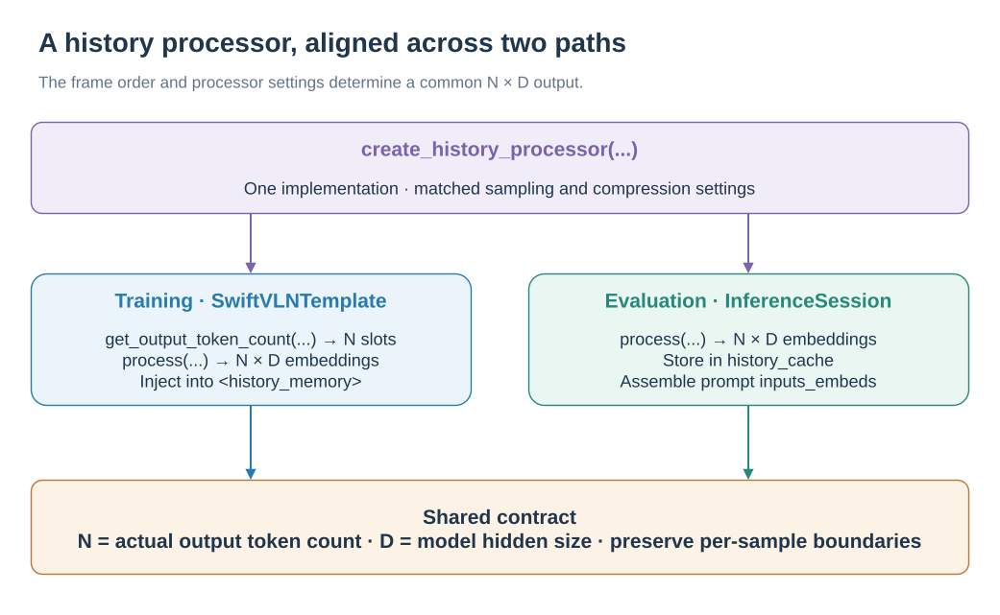

# Extending SwiftVLN

[简体中文](../../zh-CN/development/EXTENDING.md) | English

SwiftVLN training and evaluation share experiment configuration, model names, Memory, and embedding implementations. When adding a capability, keep training arguments, online inference, checkpoints, and model names consistent. See [Architecture](ARCHITECTURE.md) for module relationships.

## 1. Public extension interfaces

| Interface | Source of truth | Constraints that need to be maintained |
| --- | --- | --- |
| Experiment configuration |`src/swiftvln/experiment.py`| Parameter combinations can be verified and parsed round-trip by model name |
| Training parameters |`training/sft/arguments.py`| Dataset, Template and model loader receive the same configuration |
| Evaluation parameters |`evaluation/arguments.py`| Consistent with the training configuration and written into the evaluation summary |
| Shell entry |`scripts/train/`, `scripts/eval/`| Environment variables are correctly passed to Python CLI |
| Checkpoint |`modeling/model.py`| New parameters and weights can be saved, restored and continued evaluation |
| Testing |`tests/`| Configuration, structure, data flow and checkpoint contract remain stable |

If the capability appears in model names, define a unique name fragment before updating the training and evaluation entry points.

## 2. Add an environment Backend

### 2.1 Define environment semantics

Add `EnvironmentSpec` to `src/swiftvln/backends/specs.py` and add `_ENVIRONMENT_SPECS`. Spec is responsible for simulator-independent static semantics:

| Field | Content |
| --- | --- |
|`name`| Environment identifier, used for training parameters, evaluation parameters and model name |
|`forward_step_m`| Distance of Forward action |
|`turn_angle_deg`| Steering angle of Left/right action |
|`prompt_template`| Navigation task system prompt |
|`config_argument`| Corresponding configuration file field name in evaluation parameters |
|`supports_map_memory`| Whether to support Map memory |
|`reports_trajectory_types`| Whether to output metrics grouped by trajectory type |
|`action_symbols`| Action ID and order of output symbols |

The training Dataset obtains the prompt, action symbols and pose integration parameters through `get_environment_spec()`. Add environment branch to Dataset.

### 2.2 Implement Backend and Wrapper

Create `src/swiftvln/backends/<env>/`:

| Documentation | Responsibilities |
| --- | --- |
|`config.py`| Load task configuration and apply split, datapath and GPU override |
|`wrapper.py`| Adapt emulator to `EnvWrapper`|
|`backend.py`| Combined configuration, emulator, action parser and video hook |
|`video.py`| Optional video frame collection and saving |
|`__init__.py`| Keep exporting lightweight |

`EnvWrapper` must implement:

- `reset(episode)` and `step(action)`;
- `get_rgb()`, `get_instruction()` and `get_metrics()`;
- `episodes`, `episode_over`, `max_steps` and `env_type`;
- `close()`.

Import simulator packages inside the actual loading function in `Backend.create_wrapper()` or `config.py`. Use `TYPE_CHECKING` in `wrapper.py` for simulator types so the core package remains importable without that simulator installed.

### 2.3 Register training and evaluation entry points

Make the following changes:

1. Register Backend at `_BACKEND_CLASSES` at `backends/factory.py`;
2. Add environment choice and configuration path parameters in `evaluation/arguments.py`;
3. Update `ENV_TYPES`, model name regularization and environment constraints at `experiment.py`;
4. Add the default trajectory path to the training script;
5. Add default task configuration, split and Python parameters to the evaluation script;
6. Add the YAML published with the package at `src/swiftvln/configs/<env>/`;
7. Add local data and scene paths to `local.env.example`.

Offline trajectories for the new environment must satisfy the data contract in Section 6. The Wrapper handles simulator-specific episode fields; do not add environment-specific branches to `EnvironmentEpisodeLoop` or `SwiftVLNInferenceSession`.

## 3. Add a History Processor

### 3.1 Implement the processor

Add `HistoryProcessor` subclass to `src/swiftvln/modeling/history/`:

| Method | Contract |
| --- | --- |
|`get_output_token_count(num_frames, frame_infos)`| Return the number of placeholder tokens before visual encoding |
|`process(frame_embeds_list, frame_grid_thws)`| Return `[num_tokens, hidden_size]`|
|`name`| Stable name to use for logs |

The result of `get_output_token_count()` must exactly match the first dimension returned by `process()`. A processor receives history frames from one sample; never mix tokens from different batch samples.

### 3.2 Register and pass parameters

1. Register the type and factory construction parameters at `modeling/history/__init__.py`;
2. Add public name in `HISTORY_PROCESSORS` of `experiment.py`;
3. Add stable encoding and parsing rules for model names;
4. Add hyperparameters to training and evaluation arguments;
5. Set defaults and pass parameters in training and evaluation shells;
6. Create a processor with the same configuration in `SwiftVLNSft._prepare_template()`;
7. Create the processor used for online evaluations in `SwiftVLNInferenceSession`;
8. Record the parameters that affect the inference results in `build_summary_extras()`.

### 3.3 Align training and online inference

<p align="center">
  <a href="../../assets/workflows/processor-contract.en-US.svg"></a>
</p>

*Training reserves token slots; online inference caches embeddings. Both paths use the same processor output contract.* · [Editable draw.io source](../../assets/workflows/processor-contract.en-US.drawio)

Training-side history selection is implemented in `SwiftVLNDataset._sample_history_frames()`. Online cache construction is implemented in `evaluation/inference/encoding.py`. If a processor changes sampling or caching, update both paths.

The Template calls `get_output_token_count()` to create `<history_memory>` placeholders, then calls `process()` to generate embeddings. The inference session writes the `process()` output directly to `history_cache`. Both paths must use the same frame order, processor parameters, and output-token count.

## 4. Add an Embedding Enhancement

Embedding enhancement runs after the vision tower and before history compression. The public configuration is mutually exclusive: a model enables at most one enhancement.

### 4.1 Implement the module

Add `BaseEmbeddingEnhancement` subclass to `src/swiftvln/modeling/embeddings/` to implement:

| Interface | Contract |
| --- | --- |
|`forward(embed, H, W, **kwargs)`| Both input and output are `[num_tokens, hidden_size]`|
|`name`| Stable log name |

The module is stored in `EmbeddingEnhancementPipeline.enhancements`, an `nn.ModuleDict`. Its parameters are therefore included automatically in the optimizer and checkpoint `state_dict`.

### 4.2 Register the public mode

Update the following together:

1. `experiment.py`: `EMBEDDING_MODES`, name resolution, mutual exclusion rules and auxiliary judgment functions;
2. `modeling/embeddings/__init__.py`: Create module in `create_embedding_pipeline()`;
3. `modeling/embeddings/runtime.py`: declare target module, rebuild conditions and compatible alias;
4. `training/sft/arguments.py` and `evaluation/arguments.py`: add parameters;
5. `modeling/model.py`: Read parameters from loader kwargs and write to model config;
6. Training and evaluation shells: verify patterns, pass parameters, and generate names;
7. `build_summary_extras()`: Record inference configuration.

### 4.3 Add image metadata

Both the training Template and online `VisualEncodingMixin` call the module through `model.embed_enhance(embed, H, W, **kwargs)`. If the enhancement requires per-image metadata beyond pose, also update:

- Image metadata generation and sequence for `SwiftVLNDataset`;
- `SwiftVLNTemplateMixin._encode()` with multimodal collator;
- Status record of `SwiftVLNInferenceSession`;
- `VisualEncodingMixin._encode_frame()` and `_encode_batch_frames()`.

The metadata sequence must be consistent with `images` and the per-image token boundary output by the visual tower. Save checkpoint Later, the same pipeline type, configuration, and weights should be restored when loading a model from a pure checkpoint directory.

## 5. Add a model family

### 5.1 Transformers and ms-swift registration

Added in `modeling/model.py`:

- SwiftVLN config that inherits upstream Transformers config;
- SwiftVLN model class that inherits the upstream conditional-generation model;
- A loader that can add special tokens, mount enhancements and restore weights;
- New models require `inputs_embeds` or visual output compatible logic.

Then register Transformers class, ms-swift `ModelMeta`, and default model in `modeling/registry.py` ID, model architecture, Template and loader. `register_swiftvln_models()` must remain repeatable call.

### 5.2 Template

Create SwiftVLN Template based on the corresponding ms-swift Template in `modeling/template.py` and reuse it `SwiftVLNTemplateMixin`. New model families require confirmation:

- processor image returns `image_grid_thw`;
- Visual output can be split into individual images;
- The token IDs of `<history_memory>` and `<current_image>` are correct;
- Compatible with `inputs_embeds`, attention mask, position IDs and generation API;
- The number of placeholder tokens of the History processor is consistent with the actual output.

### 5.3 Configuration and name

Synchronous updates:

1. `MODEL_FAMILIES`, model name prefix and parsing rules for `experiment.py`;
2. Explicit mapping of `model_type → model_family` in training and evaluation arguments;
3. `MODEL_FAMILY` branch of training and evaluation shell, default model path and running parameters;
4. `local.env.example` and model download documents;
5. Legal and illegal examples in model name contract.

## 6. Modify the data contract

### 6.1 Offline training data

Each trajectory directory contains `annotations.json` and the corresponding RGB directory. The core annotation fields are:

```json
{
  "video": "relative/trajectory/path",
  "instructions": ["navigation instruction"],
  "actions": [-1, 1, 2, 1, 0]
}
```

`video/rgb/` stores observation frames in temporal order. In `actions`, `-1` represents the initial state; `0/1/2/3` correspond to STOP, forward, left, and right in `EnvironmentSpec.action_symbols`.

When modifying the annotation schema, synchronization is required:

- trajectory generator and validation CLI;
- Read, window index, and output fields for `SwiftVLNDataset`;
- Map metadata resolver or image-by-image metadata generation;
- SatNav/Habitat training data documentation.

### 6.2 Dataset–Template boundary

`SwiftVLNDataset` outputs `messages`, `images` and image count metadata. The image order is fixed to:

```text
history images → initial observation → current observations
```

The new field must be able to reach the Template through ms-swift `StdTemplateInputs.extra_kwargs`. Template The collator needs to preserve boundaries by sample, and cannot lose correspondence after flattening image counts or metadata of different samples.

### 6.3 Online episodes and results

The emulator Episode's field differences are adapted by `EnvWrapper`. Runner only relies on `episode_id`, `scene_id`, instruction and optional `trajectory_type`.

When modifying the evaluation result field, update at the same time:

- `SwiftVLNEvaluationRunner.evaluate_episode()` ；
- `ResultRecorder` and `evaluation/reporting.py`;
- resume/dedup contract；
- [Output description from SwiftVLN evaluation](../evaluation/README.md).

## 7. Verify changes

Run the contract corresponding to the change in the `swiftvln-train` environment:

| Changes | Test Entry point |
| --- | --- |
| Experiment configuration and model name |`tests.test_experiment_contract`, `tests.test_model_name_contract`|
| Backend | `tests.test_backend_contracts`, `tests.test_evaluation_structure_contract` |
| History processor | `tests.test_history_contracts`, `tests.test_phase6_behavior_contracts` |
| Embedding enhancement | `tests.test_embedding_contract`, `tests.test_uav_adapter_strategy` |
| Dataset / Template | `tests.test_dataset_contracts`, `tests.test_training_structure_contract` |
| Results and Recovery |`tests.test_eval_contracts`|
| CLI and repository boundaries |`tests.test_cli_contracts`, `tests.test_repository_layout_contract`|

```bash
python -m unittest \
  tests.test_experiment_contract \
  tests.test_model_name_contract \
  tests.test_dataset_contracts \
  tests.test_training_structure_contract \
  tests.test_evaluation_structure_contract
```

Check the syntax after modifying the Shell entry:

```bash
bash -n scripts/train/train_swiftvln_qwen_vl.sh
bash -n scripts/eval/eval_by_name.sh
bash -n scripts/eval/eval_swiftvln_qwen_vl_distributed.sh
```

Changes to model forward or data flow also require one real optimizer step, checkpoint save and reload, and a single-episode online evaluation. For distributed changes, also verify multi-rank episode sharding, result deduplication, and interruption recovery.

## 8. Update documentation

| Changes | Sync Page |
| --- | --- |
| Install dependencies and third-party repositories | [Install](../getting-started/INSTALLATION.md)|
| Base model and checkpoint | [Model and Checkpoint](../getting-started/CHECKPOINTS.md)|
| Training parameters and model name | [SwiftVLN training](../training/README.md)|
| Memory / embedding | [Memory training configuration](../training/MEMORY.md)|
| Training or evaluation data | Corresponding page under `docs/en-US/data/` |
| Evaluation entry point, output and metrics | [SwiftVLN evaluation](../evaluation/README.md)|
| Module boundary or dependency direction | [Code architecture](ARCHITECTURE.md)|
