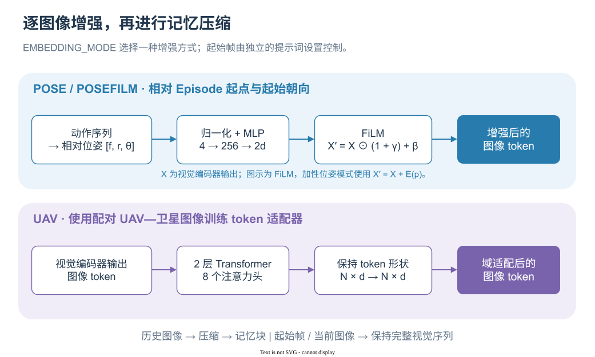

# 输入增强：起始帧、位姿与 UAV 适配器

[English](../../en-US/concepts/AUGMENTATION.md) | 简体中文

记忆压缩决定保留多少历史信息，输入增强则决定每张图像携带怎样的信息。SwiftVLN 支持在 system prompt 中保留起始帧，以及在视觉编码后加入相对位姿或 UAV 域适配。参数入口见[记忆配置](../training/MEMORY.md)和[Stage-A 训练](../training/S2R_STAGE_A.md)。

## 1. 起始帧作为固定视觉参照

`SYSTEM_PROMPT_SETTING=initial` 在每个窗口的 system prompt 中添加 Episode 第一张图像。它使用完整的视觉 token 序列；参考 Qwen2.5-VL 设置下为 256 个 token。历史采样仍独立进行，因此起始图像也可能同时出现在压缩历史中。

起始帧持续提供出发场景的细节，帮助模型将当前视野与旅程起点关联。在线实现只在 Episode 开始时编码并保存 `initial_features`，后续窗口继续注入。模板沿用 `<image>` → `<current_image>` 的完整图像路径。

## 2. 相对位姿怎样产生

位姿以 Episode 起点和起始朝向为参考。令 $f$ 表示沿起始前向的位移、$r$ 表示沿起始右向的位移、$\theta$ 表示相对航向。执行前进距离 $\ell$ 时：

$$
f\leftarrow f+\ell\cos\theta,\qquad
r\leftarrow r+\ell\sin\theta.
$$

右转增加 $\theta$，左转减小 $\theta$，转角由所选环境定义。训练使用专家动作序列积分；评测使用已经执行的动作积分，Episode 开始时为零位移与零相对航向。这样，每张图像对应的位姿来源在两条路径中一致。

输入增强模块把每图像位姿转成：

$$
p_i=[\tanh(f_i/s),\tanh(r_i/s),\sin\theta_i,\cos\theta_i],
\qquad s=100\ \text{m（默认）}.
$$

平移归一化把数值压到有限范围，航向用正弦和余弦表达，使角度绕回时特征连续。这里的位移来自离散动作积分，精度随动作模型与实际运动的一致程度变化。

## 3. FiLM 怎样改变视觉 token

`EMBEDDING_MODE=posefilm` 选择 FiLM 位姿增强。两层 MLP 为 `Linear(4,256) → GELU → Linear(256,2d)`，输出逐通道的缩放与偏置：

$$
[\gamma_i,\beta_i]=\operatorname{MLP}(p_i),\qquad
X'_i=X_i\odot(1+\gamma_i)+\beta_i.
$$

$X_i\in\mathbb R^{n_i\times d}$ 是一张图像的视觉 token。相同的 $\gamma_i,\beta_i$ 广播到该图像的所有 token，使模型能根据图像所在的相对位置与朝向调整视觉通道。最后一层权重和偏置初始化为零，因此开始训练时 $X'_i=X_i$。

代码还提供 `EMBEDDING_MODE=pose`，MLP 输出 $d$ 维向量并直接加到每个 token 上。模块参数 `beta` 是额外的融合强度，默认值为 1；上面的公式采用这一默认值，FiLM 的偏置在代码中命名为 `bias`。

增强发生在历史压缩之前，并作用于历史、起始及当前图像：

  

*两条彩色分支表示可选择的增强模式；图中的 FiLM 使用默认融合强度 1。* · [draw.io 源文件](../../assets/concepts/diagrams/input-enhancement.zh-CN.drawio)

因此，即使后续 GTC 合并了多个时刻的 token，参与聚合的特征也已经携带位姿信号。

## 4. Stage-A 如何把 UAV 特征对齐到卫星域

论文使用 24,467 对视野范围与朝向对齐的 UAV—卫星图像，其中 21,216 对训练、3,251 对验证。两张配对图像先经过冻结的 Qwen2.5-VL 视觉编码器 $f$：

$$
U_i=f(x_i^u),\quad S_i=f(x_i^s),\quad \widetilde U_i=A_\phi(U_i).
$$

UAV 分支经过可训练适配器，卫星分支提供目标特征。适配器保留 token 数量与维度，默认由 2 层 Transformer 组成，每层 8 个注意力头，MLP 扩张比 4，dropout 为 0；各层包含预归一化、自注意力、残差连接和 MLP，最后再做 LayerNorm。

对变长图像 token 使用带有效位掩码的平均池化，得到 $\bar u_i$ 与 $\bar s_i$。两种损失分别约束原始特征空间和共享投影空间。

**余弦损失**直接拉近池化后的 UAV 与卫星特征：

$$
\mathcal L_{\mathrm{cos}}=\frac1B\sum_i
\left(1-\cos(\bar u_i,\bar s_i)\right).
$$

**双向对比损失**先通过共享投影头 $P_\psi$，再 L2 归一化得到 $z_i^u,z_i^s$。以 UAV 检索卫星的方向为例：

$$
\mathcal L_{u\to s}=-\frac1B\sum_i\log
\frac{\exp((z_i^u)^\top z_i^s/\tau)}
{\sum_j\exp((z_i^u)^\top z_j^s/\tau)}.
$$

交换两个域得到 $\mathcal L_{s\to u}$，最终：

$$
\mathcal L=\tfrac12(\mathcal L_{u\to s}+\mathcal L_{s\to u})+
\mathcal L_{\mathrm{cos}}.
$$

对比项让同地点的配对特征在一批候选中互相匹配；余弦项保留对卫星原始特征空间的直接约束。Stage-A 优化器只更新适配器与投影头。验证用双向 Recall@1/5/10 和配对余弦相似度，并按 UAV→卫星 Recall@1 选择最佳 checkpoint。

## 5. 适配器怎样接入导航

导航加载 `adapter_kwargs` 和 `adapter_state_dict` 重建适配器，将其插入视觉编码器之后、历史压缩之前。导航使用适配后的逐 token 特征；Stage-A 的投影头服务于对比训练，导航加载器读取适配器部分。

当前 `UAVAdapterEnhancement` 支持 `apply_scope=all_images`，选中这一模式后，历史、起始和当前输入图像都经过适配器。输入图像的域由数据和使用流程决定。`EMBEDDING_MODE` 在 `none`、`pose`、`posefilm`、`uav` 中选择一种；起始帧由独立的 prompt 设置控制。

增强模块通过 `EmbeddingEnhancementPipeline` 的 `nn.ModuleDict` 注册，参数进入模型的 `state_dict`，因此可以随导航 checkpoint 保存与恢复。

## 6. 代码与论文对应

| 环节 | 实现入口 |
| --- | --- |
| 相对位姿积分 | [`reconstruct_pose_from_actions`](../../../src/swiftvln/modeling/embeddings/pose_utils.py) |
| 归一化、MLP、FiLM 与零初始化 | [`PoseEmbedding`](../../../src/swiftvln/modeling/embeddings/pose_embed.py) |
| 增强模块注册与调用 | [`EmbeddingEnhancementPipeline`](../../../src/swiftvln/modeling/embeddings/pipeline.py) |
| Transformer 适配器 | [`Sim2RealAdapter`](../../../src/swiftvln/modeling/embeddings/s2r_adapter.py) |
| 冻结视觉编码器与投影头 | [`tools/s2r/model.py`](../../../tools/s2r/model.py) |
| 对比损失与余弦损失 | [`tools/s2r/losses.py`](../../../tools/s2r/losses.py) |
| Stage-A 优化流程 | [`tools/s2r/trainer.py`](../../../tools/s2r/trainer.py) |
| 导航 checkpoint 接入 | [`UAVAdapterEnhancement`](../../../src/swiftvln/modeling/embeddings/uav_adapter.py) |

论文依据：[SatNav 论文](https://openreview.net/forum?id=hOEniyN6hl)，附录 **Memory Design Details → Initial Frame Prompting / Pose Encoding** 与 **Satellite-to-UAV Adapter Details**。
