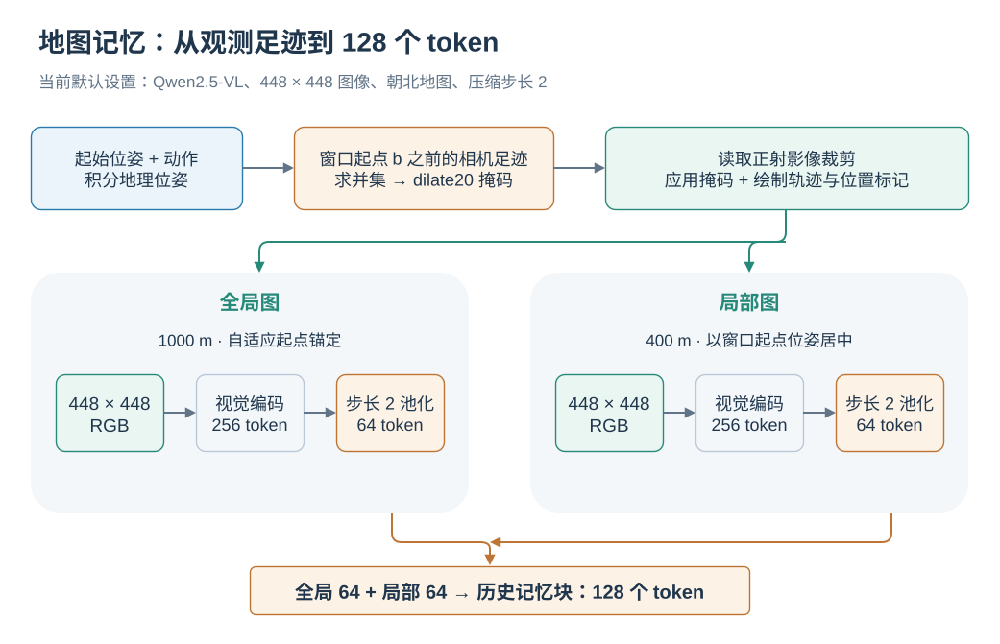
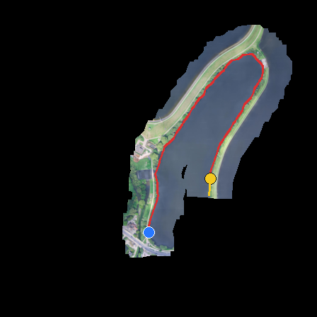
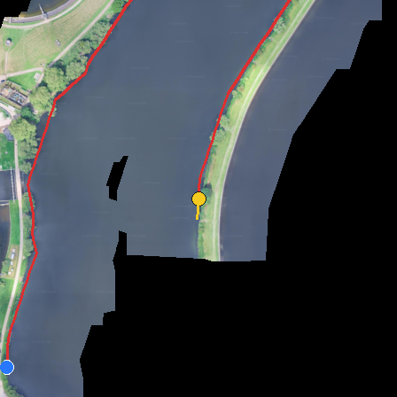
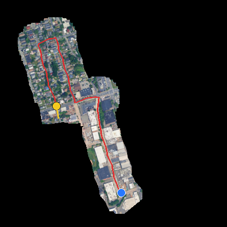
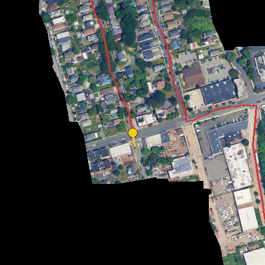

# 地图记忆：把已探索区域编码成视觉上下文

[English](../../en-US/concepts/MAP_MEMORY.md) | 简体中文

Map memory 将窗前的空间经历表示为两张朝北的俯视地图：全局图提供较大范围的路线关系，局部图提供窗口起点附近的细节。两张图通过与当前观测共享的视觉编码器转换成 token，放入 `<history_memory>`。其更新时机与[其他长期记忆](PIPELINE.md)一致。

  

*两张地图共享视觉编码器；每张分别池化后，再拼接为历史记忆。*

## 1. 从轨迹生成两张地图

构图需要 SatNav 场景正射影像、Episode 起始经纬度与航向、已经执行的动作，以及相机视场角和高度。实现流程为：

1. 将起点转换到 Web Mercator 坐标，用前进步长和转向角逐步积分动作，得到位置与航向序列。
2. 以新窗口起点 $b$ 为边界，取索引小于 $b$ 的位姿计算已观测区域；轨迹折线包含窗口起点位置。
3. 根据高度、水平视场角、宽高比和航向计算每次观测覆盖地面的四边形，将这些足迹合并为掩码。
4. 从场景影像读取全局与局部正方形裁剪，将掩码之外的像素置黑。
5. 绘制红色轨迹、蓝色起点和黄色当前位置及朝向，输出 `[global_map, local_map]`。

对朝下相机，足迹宽度由 $2h\tan(\mathrm{HFOV}/2)$ 决定，足迹高度再由图像宽高比确定。地理坐标换算包含纬度相关的 Mercator 比例修正，使地图边长参数仍以地面米为单位。

这里的“当前位置”是构建记忆时的新窗口起点。窗口内部继续执行动作时，地图保持这一快照，直到下一次滑窗。

## 2. 全局图、局部图和探索掩码

| 项目 | 当前默认实现 | 含义 |
| --- | --- | --- |
| 全局图 | 边长 1000 m | 保留路线与起点附近的整体关系 |
| 局部图 | 边长 400 m，以窗口起点为中心 | 放大近期位置附近的空间结构 |
| 渲染分辨率 | 两张图均为 448 × 448 | 固定输入图像大小 |
| `strict` 掩码 | 已观测相机足迹的并集 | 保留实际足迹覆盖区域 |
| `dilate20` 掩码 | 足迹掩码向外膨胀约 20 m | 同时显示观测边界附近的一圈影像 |

膨胀通过像素最大值滤波实现，半径约为 `round(20 / side_m * render_px)`。因此，同样的 20 m 在全局图和局部图中对应不同像素半径。

当前 `SatNavMapMemoryBuilder` 默认使用 `adaptive_start`：以起点为锚，当轨迹与观测覆盖范围接近边界时平移固定大小的裁剪区域。实现采用 10% 边缘余量和 25 m 的平移量化。类本身也支持固定的 `start` 模式。全局图与局部图均保持朝北，黄色箭头单独表达航向。

第一窗口 $b=0$ 时，历史足迹为空，地图背景为黑色，仍绘制起点和当前标记。后续窗口逐步积累已探索区域。

## 3. 全局图与局部图示例

  
  

*London-2：左为全局图，右为局部图。蓝色为起点，黄色为窗口边界处的位置与朝向，红色为轨迹。图取自论文附录的 Map Memory 示例。*

  
  

*NewYork-1：左为全局图，右为局部图。与上面的 London-2 一起展示不同路线下的探索范围。图片取自论文附录。*

地图把多次观测放到同一个地理坐标系中，因此路线形状、是否回到旧区域，以及起点与当前位置的关系能够在同一图像中表达。表示质量依赖动作积分、场景影像和地理配准；当前实现用于具有这些信息的 SatNav。

## 4. 地图怎样变成记忆 token

训练时 Dataset 调用构图器，将两张地图放在 `images` 的历史位置；评测时 `_compute_history_cache_map()` 渲染地图并编码。两条路径都会继续执行 per-frame 压缩，然后把全局图 token 与局部图 token 顺序拼接。

当前默认 `COMPRESS_STRIDE=2`。对 Qwen2.5-VL 的 448 × 448 输入，每张地图编码后有 256 个 token，经额外的二维池化得到 64 个，两张图按“全局、局部”的顺序组成 128-token 记忆块。

| 压缩设置 | 每张地图编码后 | 每张地图池化后 | 两张图合计 |
| --- | --- | --- | --- |
| 默认 `COMPRESS_STRIDE=2` | $16\times16=256$ | $8\times8=64$ | 128 |
| `COMPRESS_STRIDE=1` | $16\times16=256$ | 256 | 512 |

图像大小或骨干改变后，数量从实际 `image_grid_thw` 与 `merge_size` 计算。stride 控制地图细节与 LLM 上下文开销：减小 stride 保留更密的视觉网格，也增加输入 token 数。参数与启动示例见[Map memory 配置](../training/MEMORY.md)。

## 5. 构图缓存与代码入口

地图生成可使用磁盘缓存，复用同一轨迹前缀及渲染配置的图像。在线推理另外保存编码后的地图 token，并在窗口内部重复使用。前者减少影像读取与渲染，后者减少同一窗口的视觉编码。

| 环节 | 实现入口 |
| --- | --- |
| 默认参数与构图器组合 | [`SatNavMapMemoryBuilder`](../../../src/swiftvln/modeling/memory/satnav_map.py) |
| 动作积分、相机足迹和影像裁剪 | [`MapGeometryMixin`](../../../src/swiftvln/modeling/memory/geometry.py) |
| 掩码、中心选择、轨迹绘制 | [`MapRenderMixin`](../../../src/swiftvln/modeling/memory/render.py) |
| 训练样本的场景与 Episode 信息 | [`metadata.py`](../../../src/swiftvln/modeling/memory/metadata.py) |
| 磁盘图像缓存 | [`MapCacheMixin`](../../../src/swiftvln/modeling/memory/cache.py) |
| 在线编码和池化 | [`_compute_history_cache_map`](../../../src/swiftvln/evaluation/inference/encoding.py) |

论文依据：[SatNav 论文](https://openreview.net/forum?id=hOEniyN6hl)，附录 **Memory Design Details → Map Memory**；示例图片来源见[素材说明](https://github.com/Eku127/SwiftVLN/blob/master/docs/assets/concepts/README.md)。
