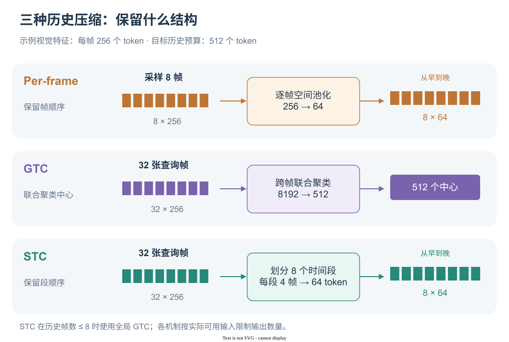

# 历史记忆：采样、逐帧压缩与 token 聚类

[English](../../en-US/concepts/MEMORY.md) | 简体中文

历史记忆把当前窗口之前的视觉观测转换为一段紧凑的特征序列。不同机制改变了三个环节：读哪些历史图像、怎样合并视觉 token、输出中保留怎样的时间和空间结构。窗口与更新时机见[双层记忆与滑动窗口](PIPELINE.md)，启动命令见[记忆配置](../training/MEMORY.md)。

## 1. 几种机制的输入与输出

以下 token 数按代码的 Qwen2.5-VL、448 × 448 图像网格计算：视觉编码器及其原生空间合并后，每帧为 $16\times16=256$ 个 token。

| 机制 | 历史输入 | 输出如何组织 | 典型预算 |
| --- | --- | --- | --- |
| Short-term only | 无窗前图像 | 只保留窗口内对话 | 0 |
| Per-frame pooling | 最多 8 张采样帧 | 每帧空间池化，按时间拼接 | $8\times64=512$ |
| GridToMe | 最多 8 张采样帧 | 每帧分区域聚合，再按时间拼接 | 参考网格下 512 |
| GTC | 所有窗前查询帧 | 所有帧的 token 联合聚类 | 最多 512 |
| STC / Segment-GTC | 所有窗前查询帧 | 分成 8 个时间段，段内聚类，按段拼接 | 最多 512 |

`NUM_HISTORY` 控制 per-frame 的采样数量。GTC / STC 在训练时取 `0,k,2k,…<b` 的图像，其中 $k$ 为动作预测间隔、$b$ 为窗口起点；评测时读取实际查询时缓存的窗前特征。逐帧采样的候选集合则包含窗前每个动作步的 RGB 观测。

  

方块表示图像或 token 分组，数量用于示意；图中数值给出实际预算。

## 2. 历史帧怎样采样

对长度为 $H$ 的历史前缀，最多选择 $n=\min(n_{\mathrm{req}},H)$ 帧，其中 $n_{\mathrm{req}}$ 对应 `NUM_HISTORY`。确定性采样用归一化位置 $u_i=i/(n-1)$，映射到：

$$
q_i=1-(1-u_i)^b,\qquad
r_i=\operatorname{round}\big(q_i(H-1)\big).
$$

这里指数 $b$ 对应代码的 `LOG_BASE`。$b=1$ 时均匀覆盖历史，$b=2$ 时样本向近期集中。例如 $H=100,n=5$ 时，均匀采样得到约 `[0,25,50,74,99]`，近期偏置采样得到 `[0,43,74,93,99]`。

随机模式从历史索引中等概率无放回抽样，随后排序，保留时间顺序。确定性采样若因取整产生重复，就从最早的未选帧开始补齐；只取一帧时选最近帧；可用帧少于请求数量时使用全部可用帧。训练和评测共用 `sample_per_frame_history_indices()`。

## 3. Per-frame：先压每帧，再按时间拼接

设某帧视觉编码结果为 $X_i\in\mathbb R^{h\times w\times d}$。步长为 $s$ 的平均池化对每个 $s\times s$ 局部区域求平均：

$$
\bar X_i[a,b]=\frac{1}{s^2}
\sum_{u=0}^{s-1}\sum_{v=0}^{s-1}X_i[sa+u,sb+v].
$$

代码把序列恢复成空间网格，调用 `avg_pool2d(kernel_size=s, stride=s)`，再展平。输出长度为 $\lfloor h/s\rfloor\lfloor w/s\rfloor$。参考设置 $h=w=16,s=2$，每帧得到 64 个 token，8 帧按从早到晚的顺序组成 512-token 记忆。

这保留了帧之间的先后关系，以及每帧降采样后的空间排列。相邻视角中的重复建筑仍可能各占一部分 token，因为每帧独立压缩。

### GridToMe 如何替换池化

`USE_TOME=true` 选择仓库中的网格聚合实现。它先将每帧划成 $2\times2$ 个区域，在各区域内用自适应平均池化初始化中心，再按余弦相似度聚合特征。对区域 token $x_i$ 和中心 $c_j$：

$$
w_{ij}=\frac{\exp(\cos(x_i,c_j)/0.1)}
{\sum_{i'}\exp(\cos(x_{i'},c_j)/0.1)},\qquad
z_j=\sum_i w_{ij}x_i.
$$

每个中心的权重沿输入 token 维度归一化，代码对应 `softmax(sim, dim=0)`。参考网格下，每个区域从 $8\times8$ 个 token 聚合为 $4\times4$ 个，四个区域共 64 个。输出按区域顺序拼接，随后按帧时间拼接；区域过小时实现回退到普通池化。

## 4. GTC：跨帧联合 soft k-means

GTC 将所有历史帧展平、拼接为 $X\in\mathbb R^{M\times d}$，选择 $K=\min(K_{\max},M)$ 个中心，其中 $K_{\max}$ 对应 `GTC_OUTPUT_TOKENS`。默认沿拼接序列均匀选取 token 初始化中心，温度 $\tau=0.1$，更新一次。

首先对每个 token 计算它属于各个中心的软分配：

$$
A_{ij}=\frac{\exp(\cos(x_i,c_j)/\tau)}
{\sum_{j'}\exp(\cos(x_i,c_{j'})/\tau)}.
$$

然后用分配权重更新中心：

$$
c'_j=\frac{\sum_i A_{ij}x_i}{\sum_i A_{ij}}.
$$

余弦相似度使用归一化向量，中心更新使用原始特征值。实现中的分配沿中心维度归一化，即 `softmax(..., dim=-1)`，再按每个中心收到的权重总和归一化。这与上面的 GridToMe 权重计算不同。

例如 32 张历史查询帧产生 $32\times256=8192$ 个输入 token，GTC 把它们聚合为 512 个。来自不同时刻、外观相近的 token 可以贡献给同一中心；输出中心没有逐帧分组，时间顺序仅间接存在于输入特征和初始化中。当输入总数不超过目标预算时，代码直接返回输入。

聚类没有额外的可训练中心参数。中心由当前历史特征初始化，softmax 与加权求和参与训练计算图，梯度可以回传到视觉编码器和输入增强模块。

## 5. STC：在时间段内部做 GTC

STC 由 `SegmentGTC` 实现，配置值为 `segment_gtc`。历史帧多于 8 张时，按帧数切成 8 个连续、尽量等长的片段，每段独立执行上述 GTC，再将结果从早到晚拼接：

$$
L=[\operatorname{GTC}(X^{(0)});\ldots;\operatorname{GTC}(X^{(7)})].
$$

对 32 帧、512-token 预算，每段包含 4 帧、1024 个输入 token，聚合为 64 个。整个记忆依次保存 8 段的摘要，因此后半段的中心只聚合后半段的观测，保留了粗粒度的时间结构。

当前实现的边界行为也决定实际输出：

- 帧数除以 8 的余数分配给较早片段；token 预算除以 8 的余数分配给较晚片段。
- 历史帧数不超过 8 时，走一次全局 GTC；输入 token 不足预算时直接拼接返回。
- 每段最多保留该段现有 token 数，未使用的额度留在该段，因此一般情况下实际总数为各段 `min(段预算, 段输入数)` 的和。

## 6. 如何理解预算与代价

在相同输出预算下，per-frame 先限制要编码的帧数，GTC / STC 则保留更多历史输入再压缩。以 $M$ 个输入 token、$K$ 个中心和特征维度 $d$ 计，一次 GTC 相似度计算约为 $O(MKd)$，分配矩阵大小为 $M\times K$。STC 分段计算，单个分配矩阵更小。

参考视觉 token 数的计算示例：

| 窗口起点与配置 | 历史输入 | 记忆输出 |
| --- | --- | --- |
| 起点 0，普通历史记忆 | 0 帧 | 0 |
| 起点 32，per-frame，8 帧，stride 2 | $8\times256$ | 512 |
| 起点 32，GTC，动作间隔 4 | $8\times256$ | 512 |
| 起点 128，GTC，动作间隔 4 | $32\times256$ | 512 |
| 起点 128，STC，动作间隔 4 | 8 段，每段 $4\times256$ | $8\times64=512$ |

图像尺寸与视觉骨干改变时，应从实际 `image_grid_thw` 和 `merge_size` 计算每帧 token 数。512 是这里的记忆预算；LLM 总上下文还包含指令、窗口内完整图像、动作文本和可选起始帧。

## 7. 代码与论文对应

| 环节 | 代码 |
| --- | --- |
| 逐帧采样及按时间拼接 | [`per_frame.py`](../../../src/swiftvln/modeling/history/per_frame.py) |
| 空间池化与 GridToMe | [`compressor.py`](../../../src/swiftvln/modeling/history/compressor.py) |
| soft k-means 公式与全局聚类 | [`gtc.py`](../../../src/swiftvln/modeling/history/gtc.py) |
| 时间分段、预算分配与短历史处理 | [`segment_gtc.py`](../../../src/swiftvln/modeling/history/segment_gtc.py) |
| 训练历史帧来源 | [`SwiftVLNDataset._sample_history_frames`](../../../src/swiftvln/training/sft/dataset.py) |
| 评测采样、特征复用和聚类 | [`VisualEncodingMixin`](../../../src/swiftvln/evaluation/inference/encoding.py) |

论文依据：[SatNav 论文](https://openreview.net/forum?id=hOEniyN6hl)，附录 **Memory Design Details** 中的 **History Frame Sampling / GTC / STC**。GridToMe 的计算与 STC 的边界行为依据当前代码补充。
