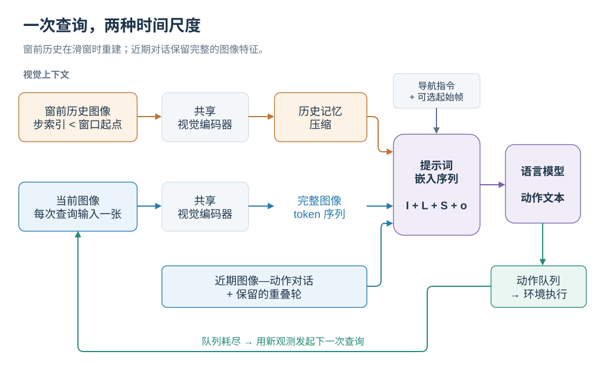
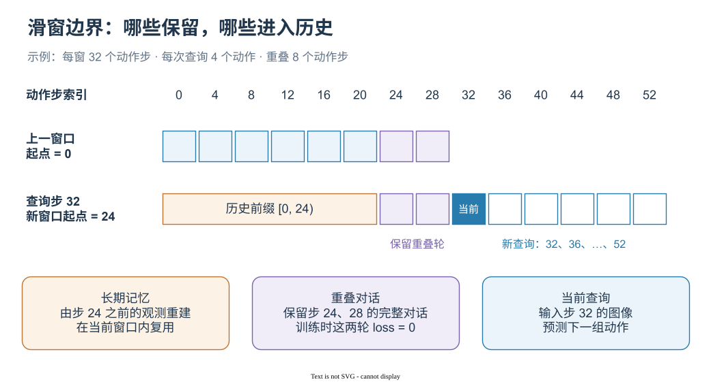

# 从观测到动作：双层记忆与滑动窗口

[English](../../en-US/concepts/PIPELINE.md) | 简体中文

SwiftVLN 把导航轨迹组织成多轮视觉对话：每轮输入当前位置的图像，输出一串导航动作。短期记忆保留最近几轮完整的图像与回答，长期记忆把窗口之前的观测压缩成视觉 token。两者与导航指令共同送入语言模型。

本章按当前代码解释查询、记忆更新和训练监督，论文附录提供方法背景。接着可以阅读[历史记忆的采样与压缩](MEMORY.md)、[地图记忆](MAP_MEMORY.md)和[输入增强与跨域适配](AUGMENTATION.md)。运行参数见[训练指南](../training/README.md)。

## 1. 一次查询包含什么

设 $t$ 为模型查询轮次，$\mathcal I$ 为指令，$o_t$ 为当前图像，$S_t$ 为窗口内已完成的图像—动作对话，$L_t$ 为长期记忆。输入与输出为：

$$
C_t=\Phi(\mathcal I,L_t,S_t,o_t),\qquad
Y_t=f_\theta(C_t).
$$

例如，模型生成 `↑↑→↑`，环境依次执行前进、前进、右转、前进。动作队列执行完后，再用新的观测发起查询。训练使用专家动作文本作为回答，在线评测使用模型生成的回答构建后续上下文。

  

橙色为窗前历史，蓝色为近期视觉上下文，绿色为环境执行回路。

长期记忆放在 system prompt 中，短期记忆由 user / assistant 多轮消息表示。当前图像保持视觉编码器输出的完整 token 数，历史图像再经过额外压缩。使用 Qwen2.5-VL 和 448 × 448 输入时，每张图像编码为 256 个视觉 token；默认 stride 2 将每个采样历史帧进一步压缩为 64 个。

## 2. 动作步数与查询轮次

代码中的 `NUM_FRAMES` 和 `NUM_OVERLAP` 按动作步数计量。每次预测 $k$ 个动作时，对应关系为：

$$
N_w=\frac{W}{k},\qquad
N_o=\frac{O}{k},\qquad
d=W-O.
$$

这里 $W$ 对应 `NUM_FRAMES`，$O$ 对应 `NUM_OVERLAP`；$N_w$ 是窗口轮数，$N_o$ 是重叠轮数，$d$ 是窗口起点前移的动作步数。参数按完整动作块对齐。

| 设置 | 代码参数 | 对话含义 |
| --- | --- | --- |
| 默认窗口 | `NUM_FRAMES=32`, `NUM_FUTURE_STEPS=4` | 8 轮，每轮监督 4 个动作 |
| 默认重叠 | `NUM_OVERLAP=0` | 每 32 个动作建立新窗口 |
| 重叠 2 轮 | `NUM_OVERLAP=8` | 保留末尾 2 轮，起点每次前移 24 步 |
| 重叠 4 轮 | `NUM_OVERLAP=16` | 保留末尾 4 轮，起点每次前移 16 步 |

  

空白蓝框表示新窗口中后续查询的位置；紫色两轮作为完整上下文保留。

以重叠 2 轮为例，第一窗口在动作步 `0,4,…,28` 查询。到步 32 时，新窗口起点变成 24，保留步 24、28 的图像和回答，长期记忆由步 24 之前的观测构建，当前查询使用步 32 的图像。这样，窗口边界附近的细节由重叠对话保留，更早的内容由长期记忆承接。

在线代码按已经执行的动作步数判断边界，并在动作队列为空时滑窗。默认训练目标为每轮 4 个动作；实际执行长度取决于解析得到的动作序列和 Episode 的终止状态。

## 3. 长期记忆何时更新

设新窗口起点为 $b$，历史范围为步索引 $[0,b)$。滑窗时执行一次记忆构建，窗口内的后续查询复用同一记忆块：

$$
L_{t+1}=\begin{cases}
\mathcal M(\mathcal H_{<b}), & \text{窗口滑动时},\\
L_t, & \text{窗口内继续查询时}.
\end{cases}
$$

历史采样从完整的窗前轨迹重新选择，GTC / STC 从窗前的查询帧特征重新聚类。因此，旧记忆中已经聚合过的 token 不会被当作下一次聚类的唯一输入。Episode 开始时，窗口、历史、初始图像和特征缓存一起重置。

在线状态有三类不同用途的缓存：

| 状态 | 保存内容 | 更新时机 |
| --- | --- | --- |
| `window_turns` / `overlap_context` | 图像特征、user token、assistant 动作文本 | 每次查询追加；滑窗时保留重叠轮 |
| `history_cache` | 已压缩、可直接注入提示词的长期记忆 | 新窗口开始时重建 |
| `vit_feature_cache` | GTC / STC 已编码的查询帧特征，以动作步索引为键 | 每次查询写入，Episode 结束后清空 |

固定的长期记忆输出预算控制的是送入 LLM 的历史 token 数。GTC / STC 的原始特征缓存随查询次数增长，聚类也会处理越来越多的历史输入。

## 4. 视觉 token 如何进入 LLM

训练数据中的 `images` 顺序是“历史图像、可选起始图像、当前窗口图像”。`num_history_images`、`num_initial_images` 和 `frame_poses` 让模板能识别每张图像的作用。

模板分两步处理视觉输入：

1. `_encode()` 根据图像网格和记忆处理器计算输出长度，把 `<history_memory>` 展开成整个记忆块所需的占位 token，把每个 `<current_image>` 展开成对应图像的完整视觉 token 数。
2. `_post_encode()` 调用视觉编码器，逐图像应用可选增强，再压缩历史特征，最后将这些向量写入占位位置的 `inputs_embeds`。

因此，`<history_memory>` 在提示词源码中只出现一次，但它在 LLM 输入中可以占据 512 个向量位置。初始帧和当前帧使用 `<current_image>` 路径，起始帧通过这一共享路径注入。

评测中的 `PromptConstructionMixin` 直接组装相同语义的 embedding 序列，再调用 `model.generate()`。每轮都会组装完整窗口；`generate(use_cache=True)` 使用本次生成过程的缓存，跨查询保存的是上表中的图像与对话状态。

## 5. 训练怎样对应在线滑窗

`SwiftVLNDataset` 用步长 $d$ 从专家轨迹构造训练窗口，每隔 `NUM_FUTURE_STEPS` 步选一张当前图像，将后续动作转成回答文本。对于起点大于零的重叠窗口，前 $N_o$ 个 assistant 回答设置 `loss=0.0`：它们作为上下文参与注意力，新进入窗口的回答承担监督目标。

动作文本采用自回归监督，可写成：

$$
\mathcal L_{\mathrm{SFT}}=-\sum_{j\in\mathcal T_{\mathrm{new}}}
\log p_\theta(y_j\mid C,y_{<j}),
$$

其中 $\mathcal T_{\mathrm{new}}$ 表示有监督的新回答 token。训练时这些上下文来自专家轨迹；评测时来自已经执行的动作和模型此前的回答。

## 6. 从哪里读代码

| 问题 | 实现入口 |
| --- | --- |
| 如何切训练窗口、生成消息和屏蔽重叠损失？ | [`SwiftVLNDataset.__getitem__`](../../../src/swiftvln/training/sft/dataset.py) |
| 如何分配占位 token 并注入视觉向量？ | [`SwiftVLNTemplate._encode / _post_encode`](../../../src/swiftvln/modeling/template.py) |
| 什么时候查询、滑窗和执行动作？ | [`EnvironmentEpisodeLoop.run`](../../../src/swiftvln/evaluation/episode_loop.py) |
| 如何保留重叠轮和重建历史？ | [`WindowStateMixin.slide_window`](../../../src/swiftvln/evaluation/inference/window.py) |
| 如何组装完整上下文？ | [`PromptConstructionMixin`](../../../src/swiftvln/evaluation/inference/prompt.py) |
| 如何生成动作并保存查询帧？ | [`SwiftVLNInferenceSession.predict`](../../../src/swiftvln/evaluation/inference/session.py) |

论文依据：[SatNav 论文](https://arxiv.org/abs/2609.31507)，附录 **SwiftVLN Framework Details → Overall Pipeline / Prompt Construction**。本组原理文档核对的代码版本为 [`7984ed6`](https://github.com/Eku127/SwiftVLN/tree/7984ed6fa053e8cba1648c16d0ae7944c8eba25d)。
