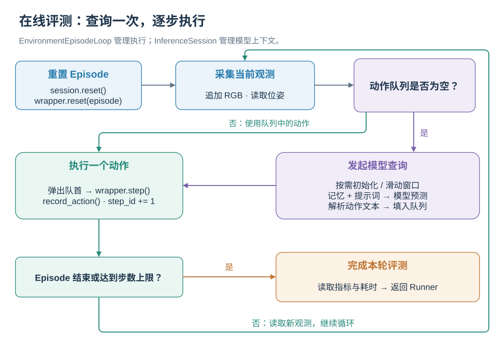
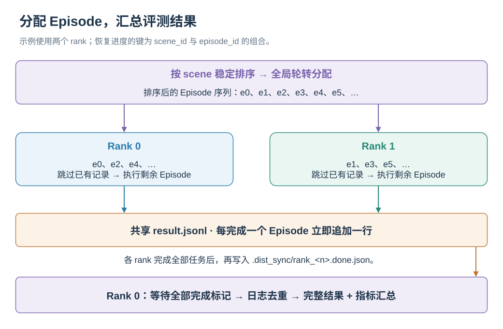

# SwiftVLN 评测

简体中文 | [English](../../en-US/evaluation/README.md)

SwiftVLN 使用统一入口在 SatNav 和 Habitat 中执行在线评测。评测脚本从模型名称恢复训练
配置，加载对应 checkpoint，并将 Episode 分配到指定 GPU。

| 环境 | 默认 Split | 场景 | 最大步数 |
| --- | --- | --- | ---: |
| SatNav | `val_seen`、`val_unseen` | GeoTIFF | 500 |
| Habitat | `val_unseen` | MP3D | 500 |

<p align="center">
  <a href="../../assets/workflows/episode-loop.zh-CN.svg"></a>
</p>

<p class="figure-caption" align="center">动作队列为空时才触发模型查询；每次环境 step 执行队列中的一个动作。</p>

Episode 开始时重置环境和推理 session；每一步采集 RGB 与当前位姿。动作队列为空时，session 初始化或推进窗口，准备记忆和上下文，再预测下一组动作。循环逐个执行动作，并记录动作引起的位姿变化。解析得到空动作序列时使用 STOP。环境报告结束或达到步数上限后，本轮评测完成。实现见 [episode_loop.py](../../../src/swiftvln/evaluation/episode_loop.py)，窗口和记忆更新见[原理章节](../concepts/PIPELINE.md)。

## 1. 准备评测环境

开始前完成：

- [安装](../getting-started/INSTALLATION.md)：创建 `swiftvln-eval` 环境；
- [模型与 Checkpoint](../getting-started/CHECKPOINTS.md)：下载模型或准备训练 checkpoint；
- [评测数据准备](../data/EVALUATION_DATA.md)：配置 Episode 与场景路径。

进入仓库并激活评测环境：

```bash
cd /path/to/SwiftVLN
export SWIFTVLN_ROOT="${PWD}"

source .local/env.sh
source "${SWIFTVLN_CONDA_SH}"
conda activate swiftvln-eval
```

评测入口为：

```bash
bash scripts/eval/eval_by_name.sh "${MODEL_NAME}"
```

## 2. 模型名称与 Checkpoint

模型名称同时记录环境、基础模型、轨迹窗口、memory、history processor、system prompt 和
embedding enhancement。评测时使用 checkpoint 对应的完整模型名称。

默认 SatNav 模型：

```bash
export MODEL_NAME=swiftvln-satnav-3b-1ep-f32s4-overlap0-pf-h8-pool-s2-noembed
python -m swiftvln.experiment parse-name "${MODEL_NAME}" --format json
```

Habitat Qwen2.5-VL 3B 模型：

```bash
export MODEL_NAME=swiftvln-habitat-3b-1ep-f32s4-overlap0-pf-h8-pool-s2-noembed
python -m swiftvln.experiment parse-name "${MODEL_NAME}" --format json
```

使用 Qwen3-VL 2B 时设置：

```bash
export MODEL_NAME=swiftvln-habitat-qwen3vl-2b-1ep-f32s4-overlap0-pf-h8-pool-s2-noembed
```

`eval_by_name.sh` 按以下顺序查找模型：

| 优先级 | 模型位置 |
| ---: | --- |
| 1 | 环境变量 `MODEL_PATH` 指定的 checkpoint 或 Hugging Face 模型目录 |
| 2 | `output/swiftvln/<model-name>/` 中的 checkpoint |
| 3 | `output/model_zoo/swiftvln/HF_model/<model-name>/` |

按照 checkpoint 文档下载模型后，可以直接使用标准目录：

```bash
export MODEL_PATH="${SWIFTVLN_ROOT}/output/model_zoo/swiftvln/HF_model/${MODEL_NAME}"
```

评测本地训练结果时指定 checkpoint：

```bash
export MODEL_PATH=/path/to/checkpoint-step
```

## 3. 检查评测配置

`CHECK_ONLY=true` 解析模型名称，显示即将使用的模型路径与评测参数，不加载模型或启动
`torchrun`：

```bash
CHECK_ONLY=true \
EVAL_SPLIT=val_seen \
CUDA_DEVICES=0 \
bash scripts/eval/eval_by_name.sh "${MODEL_NAME}"
```

默认 SatNav checkpoint 名称为：

```text
swiftvln-satnav-3b-1ep-f32s4-overlap0-pf-h8-pool-s2-noembed
```

该名称的解析结果应包含：

```text
环境类型:       satnav
NUM_FRAMES:     32
NUM_FUTURE_STEPS: 4
NUM_OVERLAP:    0
MEMORY_METHOD:  history
HISTORY_PROCESSOR_TYPE: per_frame
NUM_HISTORY:    8
COMPRESS_STRIDE: 2
EMBEDDING_MODE: none
```

配置检查不读取 Episode 和场景；实际评测命令会同时验证模型、数据、模拟器与推理链路。

## 4. SatNav 评测

### 4.1 评测配置

SatNav 评测配置分布在以下位置：

| 配置 | 位置 | 内容 |
| --- | --- | --- |
| 任务配置 | `src/swiftvln/configs/satnav/task.yaml` | 模拟器、传感器、动作、成功距离、指标和数据集默认路径 |
| 本机路径 | `.local/env.sh` | Episode 与 GeoTIFF 路径 |
| 模型配置 | SwiftVLN 模型名称 | 轨迹窗口、memory、history processor、system prompt 和 embedding enhancement |
| 运行配置 | 启动命令的环境变量 | split、GPU、输出目录和视频 |

默认任务配置由 `eval_by_name.sh` 自动选择。使用自定义任务配置时指定：

```bash
export EVAL_CONFIG_PATH=/path/to/satnav_eval.yaml
```

数据路径通过 `.local/env.sh` 覆盖任务配置中的默认路径：

```bash
export SWIFTVLN_SATNAV_EVAL_DATA_PATH="/path/to/SatNav-v0.1/episodes/eval/{split}/all_episodes.json"
export SWIFTVLN_SATNAV_SCENES_DIR="/path/to/satnav_datasets/scenes"
```

不设置 `EVAL_SPLIT` 时依次评测 `val_seen` 和 `val_unseen`。

`evaluation_summary.json` 同时保存整体指标和按 `trajectory_type` 分类的指标。

### 4.2 评测脚本

| 脚本 | 用途 |
| --- | --- |
| `scripts/eval/eval_by_name.sh` | 推荐入口；解析模型名称、查找 checkpoint，并依次启动所需 split |
| `scripts/eval/eval_swiftvln_qwen_vl_distributed.sh` | 底层执行入口；直接使用显式提供的模型与推理参数 |
| `scripts/queue/enqueue_eval.sh`、`scripts/queue/eval_queue.sh` | 将多个模型加入文件队列并串行评测 |

通常使用 `eval_by_name.sh`：

```bash
bash scripts/eval/eval_by_name.sh "${MODEL_NAME}"
```

直接调用底层脚本时，需要显式设置环境、模型路径和与训练一致的推理参数。以下为默认 SatNav
模型：

```bash
ENV_TYPE=satnav \
MODEL_NAME="${MODEL_NAME}" \
MODEL_PATH="${MODEL_PATH}" \
EVAL_SPLIT=val_unseen \
CUDA_DEVICES=0 \
bash scripts/eval/eval_swiftvln_qwen_vl_distributed.sh
```

批量评测本地训练模型：

```bash
bash scripts/queue/enqueue_eval.sh "${MODEL_NAME}"
CUDA_DEVICES=0,1,2,3 bash scripts/queue/eval_queue.sh
```

评测模型 zoo 中的 checkpoint 时，入队命令增加 `--skip-checkpoint`，运行阶段仍由
`eval_by_name.sh` 完成模型完整性检查。

### 4.3 单卡与多卡评测

单卡评测指定 split：

```bash
EVAL_SPLIT=val_unseen \
CUDA_DEVICES=0 \
bash scripts/eval/eval_by_name.sh "${MODEL_NAME}"
```

多卡评测 `val_seen` 和 `val_unseen`：

```bash
CUDA_DEVICES=0,1,2,3 \
bash scripts/eval/eval_by_name.sh "${MODEL_NAME}"
```

评测少量 Episode 时增加 `MAX_EPISODES`：

```bash
MAX_EPISODES=1 \
EVAL_SPLIT=val_seen \
CUDA_DEVICES=0 \
bash scripts/eval/eval_by_name.sh "${MODEL_NAME}"
```

## 5. Habitat 评测

### 5.1 评测配置

Habitat 评测配置分布在以下位置：

| 配置 | 位置 | 内容 |
| --- | --- | --- |
| 任务配置 | `src/swiftvln/configs/habitat/r2r.yaml` | Habitat simulator、RGB sensor、动作、成功距离、指标与 R2R 数据集默认路径 |
| 本机路径 | `.local/env.sh` | R2R Episode 与 MP3D 场景路径 |
| 模型配置 | SwiftVLN 模型名称 | 模型族、轨迹窗口、memory、history processor、system prompt 和 embedding enhancement |
| 运行配置 | 启动命令的环境变量 | split、GPU、输出目录和视频 |

默认任务配置由 `eval_by_name.sh` 自动选择。使用自定义 Habitat 配置时指定：

```bash
export EVAL_CONFIG_PATH=/path/to/habitat_r2r_eval.yaml
```

在 `.local/env.sh` 中设置 R2R 与 MP3D 路径：

```bash
export SWIFTVLN_HABITAT_DATA_ROOT="/path/to/streamvln_datasets"
export SWIFTVLN_HABITAT_SCENES_DIR="${SWIFTVLN_HABITAT_DATA_ROOT}/scene_datasets"
export SWIFTVLN_HABITAT_R2R_EVAL_DATA_PATH="${SWIFTVLN_HABITAT_DATA_ROOT}/datasets/r2r/{split}/{split}.json.gz"
```

Habitat 默认评测 `val_unseen`。评测 `val_seen` 时显式设置 `EVAL_SPLIT=val_seen`。

### 5.2 评测脚本

Habitat 与 SatNav 使用相同的评测入口：

| 脚本 | 用途 |
| --- | --- |
| `scripts/eval/eval_by_name.sh` | 推荐入口；从模型名称恢复 Habitat、模型族与 Memory 配置并定位 checkpoint |
| `scripts/eval/eval_swiftvln_qwen_vl_distributed.sh` | 底层执行入口；使用显式提供的 Habitat 配置、模型路径与推理参数 |
| `scripts/queue/enqueue_eval.sh`、`scripts/queue/eval_queue.sh` | 将多个模型加入文件队列并串行评测 |

下载 Qwen2.5-VL 3B 模型后设置：

```bash
export MODEL_NAME=swiftvln-habitat-3b-1ep-f32s4-overlap0-pf-h8-pool-s2-noembed
export MODEL_PATH="${SWIFTVLN_ROOT}/output/model_zoo/swiftvln/HF_model/${MODEL_NAME}"
```

使用 Qwen3-VL 2B 模型时只需替换模型名称；`eval_by_name.sh` 会自动设置
`MODEL_FAMILY=qwen3_vl`：

```bash
export MODEL_NAME=swiftvln-habitat-qwen3vl-2b-1ep-f32s4-overlap0-pf-h8-pool-s2-noembed
export MODEL_PATH="${SWIFTVLN_ROOT}/output/model_zoo/swiftvln/HF_model/${MODEL_NAME}"
```

运行配置检查：

```bash
CHECK_ONLY=true \
EVAL_SPLIT=val_unseen \
CUDA_DEVICES=0 \
bash scripts/eval/eval_by_name.sh "${MODEL_NAME}"
```

直接调用底层脚本时，需要显式传入 Habitat 环境和模型参数：

```bash
ENV_TYPE=habitat \
MODEL_NAME="${MODEL_NAME}" \
MODEL_PATH="${MODEL_PATH}" \
MODEL_FAMILY=qwen2_5_vl \
EVAL_SPLIT=val_unseen \
CUDA_DEVICES=0 \
bash scripts/eval/eval_swiftvln_qwen_vl_distributed.sh
```

直接评测 Qwen3-VL 2B 模型时将 `MODEL_FAMILY` 设置为 `qwen3_vl`。

批量评测本地训练模型：

```bash
bash scripts/queue/enqueue_eval.sh "${MODEL_NAME}"
CUDA_DEVICES=0,1,2,3 bash scripts/queue/eval_queue.sh
```

### 5.3 单卡与多卡评测

单卡评测 `val_unseen`：

```bash
EVAL_SPLIT=val_unseen \
CUDA_DEVICES=0 \
bash scripts/eval/eval_by_name.sh "${MODEL_NAME}"
```

多卡评测 `val_unseen`：

```bash
EVAL_SPLIT=val_unseen \
CUDA_DEVICES=0,1,2,3,4,5,6,7 \
bash scripts/eval/eval_by_name.sh "${MODEL_NAME}"
```

依次评测 `val_seen` 与 `val_unseen`：

```bash
for split in val_seen val_unseen; do
  EVAL_SPLIT="${split}" \
  CUDA_DEVICES=0,1,2,3,4,5,6,7 \
  bash scripts/eval/eval_by_name.sh "${MODEL_NAME}"
done
```

评测少量 Episode 时增加 `MAX_EPISODES`：

```bash
MAX_EPISODES=1 \
EVAL_SPLIT=val_unseen \
CUDA_DEVICES=0 \
bash scripts/eval/eval_by_name.sh "${MODEL_NAME}"
```

评测结果使用第 7 节所述的统一目录和指标格式。

## 6. SatNav 可视化与性能分析

可视化与性能分析目前仅用于 SatNav 评测。

保存 RGB、top-down map 与导航指令可视化视频：

```bash
SAVE_VIDEO=true \
MAX_EPISODES=10 \
EVAL_SPLIT=val_unseen \
CUDA_DEVICES=0 \
bash scripts/eval/eval_by_name.sh "${MODEL_NAME}"
```

评测结束后将视频按每 400 个 Episode 打包为 ZIP：

```bash
SAVE_VIDEO=true \
VIDEO_COMPRESSION=true \
MAX_EPISODES=10 \
EVAL_SPLIT=val_unseen \
CUDA_DEVICES=0 \
bash scripts/eval/eval_by_name.sh "${MODEL_NAME}"
```

压缩完成后，`videos/` 中对应的 MP4 会被 ZIP 文件替代。

评测默认将模型生成、环境 step、窗口更新与可视化的平均耗时写入
`timing_summary.json`。输出每个 Episode 的详细耗时：

```bash
DEBUG_TIMING=true \
MAX_EPISODES=10 \
CUDA_DEVICES=0 \
bash scripts/eval/eval_by_name.sh "${MODEL_NAME}"
```

## 7. 结果与指标

<p align="center">
  <a href="../../assets/workflows/distributed-results.zh-CN.svg"></a>
</p>

<p class="figure-caption" align="center">各 rank 追加同一份 Episode 日志；rank 0 等待完成标记后生成最终结果。</p>

Runner 先按 scene 分组并排序 scene 名称，再将得到的全局序列轮转分配给各 rank。恢复时，每个 rank 读取 `result.jsonl`，跳过已记录的 `scene_id::episode_id`。每完成一个 Episode，就向这份共享日志追加一行。全部 rank 写入完成标记后，rank 0 按 Episode 键去重，生成完整结果和指标汇总。实现见 [runner.py](../../../src/swiftvln/evaluation/runner.py) 与 [results.py](../../../src/swiftvln/evaluation/results.py)。

每个 split 生成独立目录：

```text
results/eval/swiftvln/<model-name>/<split>/<timestamp>/
├── result.jsonl
├── all_results.jsonl
├── evaluation_summary.json
├── timing_summary.json
├── videos/                    # SAVE_VIDEO=true
└── .dist_sync/
    └── rank_<n>.done.json
```

| 文件 | 内容 |
| --- | --- |
| `result.jsonl` | 逐 Episode 追加写入的恢复日志 |
| `all_results.jsonl` | 评测完成后排序、去重的逐 Episode 结果 |
| `evaluation_summary.json` | 汇总指标、模型配置、split 与 GPU 数量 |
| `timing_summary.json` | 各推理阶段的平均耗时 |
| `.dist_sync/` | 多 GPU rank 完成标记 |

汇总指标包括：

| 字段 | 指标 |
| --- | --- |
| `success_rate` | Success Rate（SR） |
| `mean_spl` | Success weighted by Path Length（SPL） |
| `oracle_success` | Oracle Success（OS） |
| `navigation_error` | 平均终点导航误差（NE，米） |
| `avg_steps` | 平均执行步数 |
| `total_episodes` | 参与汇总的 Episode 数量 |

单条 Episode 发生运行错误时，结果保留在 JSONL 中，并包含 `error` 字段。
