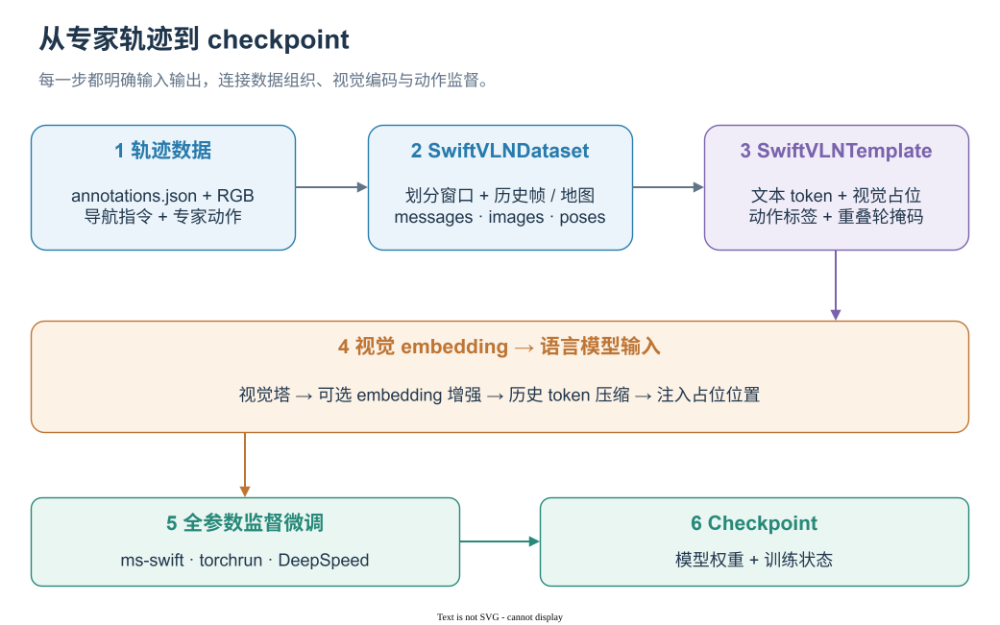

# SwiftVLN 训练

简体中文 | [English](../../en-US/training/README.md)

SwiftVLN 使用离线 expert trajectory 进行监督微调。SatNav 与 Habitat 共用训练入口，
通过 `VLN_ENV_TYPE` 选择训练环境。

<p align="center">
  <a href="../../assets/workflows/training-flow.zh-CN.svg"></a>
</p>

*轨迹窗口先转换为多模态对话，再构建 embedding 与动作监督标签。* · [draw.io 源文件](../../assets/workflows/training-flow.zh-CN.drawio)

`SwiftVLNDataset` 将图像和专家动作文本组织为窗口内的多轮对话。Template 构造视觉占位与标签，视觉编码后的历史 token 经压缩后注入对应位置。Assistant 动作轮提供监督，保留的重叠轮提供上下文并屏蔽 loss。具体 token 布局与损失定义见[双层记忆与滑动窗口](../concepts/PIPELINE.md)。

## 1. 准备环境与数据

按照[安装](../getting-started/INSTALLATION.md)创建 `swiftvln-train` 环境，并完成所需数据准备：

- [模型与 Checkpoint](../getting-started/CHECKPOINTS.md)
- [SatNav 训练数据](../data/TRAINING_DATA_SATNAV.md)
- [Habitat 训练数据](../data/TRAINING_DATA_HABITAT.md)

进入仓库并加载本机配置：

```bash
cd /path/to/SwiftVLN
export SWIFTVLN_ROOT="${PWD}"
source .local/env.sh
source "${SWIFTVLN_CONDA_SH}"
conda activate swiftvln-train
```

本页默认使用 Qwen2.5-VL 3B：

```bash
export MODEL_FAMILY=qwen2_5_vl
export MODEL_PATH="${SWIFTVLN_QWEN25_MODEL_PATH}"
```

使用 Qwen3-VL 时设置：

```bash
export MODEL_FAMILY=qwen3_vl
export MODEL_PATH="${SWIFTVLN_QWEN3_MODEL_PATH}"
export USE_LIGER_KERNEL=false
```

## 2. 默认训练配置

训练入口为：

```bash
bash scripts/train/train_swiftvln_qwen_vl.sh
```

主线训练参数如下：

| 参数 | 默认值 | 含义 |
| --- | --- | --- |
| `MODEL_FAMILY` | `qwen2_5_vl` | 基础模型系列 |
| `TRAIN_TYPE` | `full` | 使用 Full SFT 更新模型参数 |
| `NUM_EPOCHS` | `1` | 完整训练轮数 |
| `NUM_FRAMES` | `32` | 每个训练样本包含的动作帧数 |
| `NUM_FUTURE_STEPS` | `4` | 每轮根据当前观测预测的动作数 |
| `NUM_OVERLAP` | `0` | 相邻训练窗口重叠的动作数 |
| `BATCH_SIZE` | `8` | 每张 GPU 的 batch size |
| `GRAD_ACCUM_STEPS` | `1` | 梯度累积步数 |
| `LEARNING_RATE` | `2e-5` | 初始 learning rate |
| `MAX_LENGTH` | `32768` | 单个训练样本的最大 token 长度 |
| Precision | `bfloat16` | 训练精度 |
| `ATTN_IMPL` | `flash_attn` | Attention 实现 |
| `DEEPSPEED_CONFIG` | `zero2` | DeepSpeed 分布式优化配置 |

### 2.1 轨迹窗口

长轨迹按照 `NUM_FRAMES` 切分为训练窗口。相邻窗口的 stride 为：

```text
window stride = NUM_FRAMES - NUM_OVERLAP
```

`NUM_OVERLAP` 的单位是动作数。非首个窗口中的重叠动作只提供上下文，对应 assistant
turn 的 loss 会被 mask：

```text
masked turns = NUM_OVERLAP / NUM_FUTURE_STEPS
```

在默认 `NUM_FRAMES=32`、`NUM_FUTURE_STEPS=4` 下：

| `NUM_OVERLAP` | Window stride | Masked turns |
| ---: | ---: | ---: |
| `0` | `32` | `0` |
| `4` | `28` | `1` |
| `8` | `24` | `2` |
| `16` | `16` | `4` |

`NUM_OVERLAP` 必须小于 `NUM_FRAMES`，并且能够被 `NUM_FUTURE_STEPS` 整除。模型名中的
`overlap<N>` 记录重叠动作数。

### 2.2 GPU 与有效 batch size

有效 batch size 为：

```text
BATCH_SIZE × GRAD_ACCUM_STEPS × GPU 数量
```

使用前 `N` 张可见 GPU：

```bash
TRAIN_NUM_GPUS=8 bash scripts/train/train_swiftvln_qwen_vl.sh
```

指定 GPU：

```bash
TRAIN_CUDA_DEVICES=0,2,4,6 bash scripts/train/train_swiftvln_qwen_vl.sh
```

## 3. Memory 训练配置

默认 SatNav 训练使用 per-frame history。SwiftVLN 还支持随机或时间偏置历史帧采样、
Map memory、GTC、Segment-GTC、初始观测、相对位姿与 Satellite-to-UAV Stage-A adapter 等配置。

SatNav 与 Habitat 共用的配置及各项训练命令见 [Memory 训练配置](MEMORY.md)。Map memory
仅支持 SatNav。

## 4. SatNav 训练

### 4.1 配置训练数据

```bash
export VLN_ENV_TYPE=satnav
export VLN_DATA_PATH="${SWIFTVLN_SATNAV_TRAIN_DATA_PATH}"

test -f "${VLN_DATA_PATH}/annotations.json"
```

SatNav 的 `history` 训练读取 `annotations.json` 和 `images/`。`map` 训练还会读取 train
Episode、GeoTIFF 场景与 `summary.json`。

### 4.2 启动完整训练

使用 8 张 GPU 启动训练：

```bash
TRAIN_NUM_GPUS=8 bash scripts/train/train_swiftvln_qwen_vl.sh
```

### 4.3 输出模型名称

上述配置生成的模型名称为：

```text
swiftvln-satnav-3b-1ep-f32s4-overlap0-pf-h8-b1.0-pool-s2-noembed-bs64-lr2e-5-<HHMMSS>
```

| 名称片段 | 含义 |
| --- | --- |
| `swiftvln-satnav` | SwiftVLN SatNav 模型 |
| `3b` | Qwen2.5-VL 3B |
| `1ep` | 训练一个 epoch |
| `f32s4` | 每个轨迹窗口包含 32 帧，每轮预测 4 个动作 |
| `overlap0` | 相邻窗口不重叠 |
| `pf-h8-b1.0` | Per-frame memory，使用 8 张历史帧与均匀采样 |
| `pool-s2` | Average pooling，压缩 stride 为 2 |
| `noembed` | 不使用 embedding enhancement |
| `bs64` | 有效 batch size |
| `lr2e-5` | Learning rate |
| `<HHMMSS>` | 训练启动时间 |

模型保存至：

```text
output/swiftvln/<model-name>/
```

模型名称记录训练与评测共用的配置。评测时保留完整名称，
`eval_by_name.sh` 会从中恢复对应参数。

## 5. Habitat 训练

> Habitat 已验证 per-frame reference、no-memory、random、temporal-biased、initial、
> PoseFiLM、GridToMe、Additive pose、GTC 与 Segment-GTC。Satellite-to-UAV Stage-A adapter 与 Map
> memory 不支持 Habitat。

### 5.1 配置训练数据

完整 Habitat 训练组合 R2R、RxR 和 EnvDrop：

```bash
export VLN_ENV_TYPE=habitat
export VLN_DATA_PATH="${SWIFTVLN_HABITAT_R2R_TRAIN_PATH},${SWIFTVLN_HABITAT_RXR_TRAIN_PATH},${SWIFTVLN_HABITAT_ENVDROP_TRAIN_PATH}"

test -f "${SWIFTVLN_HABITAT_R2R_TRAIN_PATH}/annotations.json"
test -f "${SWIFTVLN_HABITAT_RXR_TRAIN_PATH}/annotations.json"
test -f "${SWIFTVLN_HABITAT_ENVDROP_TRAIN_PATH}/annotations.json"
```

仅使用部分数据集时，按逗号连接对应的 trajectory 目录：

```bash
export VLN_DATA_PATH="${SWIFTVLN_HABITAT_R2R_TRAIN_PATH},${SWIFTVLN_HABITAT_RXR_TRAIN_PATH}"
```

### 5.2 启动完整训练

使用 8 张 GPU 启动训练：

```bash
TRAIN_NUM_GPUS=8 bash scripts/train/train_swiftvln_qwen_vl.sh
```

### 5.3 输出模型名称

上述配置生成的模型名称为：

```text
swiftvln-habitat-3b-1ep-f32s4-overlap0-pf-h8-b1.0-pool-s2-noembed-bs64-lr2e-5-<HHMMSS>
```

| 名称片段 | 含义 |
| --- | --- |
| `swiftvln-habitat` | SwiftVLN Habitat 模型 |
| `3b` | Qwen2.5-VL 3B |
| `1ep` | 训练一个 epoch |
| `f32s4` | 每个轨迹窗口包含 32 帧，每轮预测 4 个动作 |
| `overlap0` | 相邻窗口不重叠 |
| `pf-h8-b1.0` | Per-frame memory，使用 8 张历史帧与均匀采样 |
| `pool-s2` | Average pooling，压缩 stride 为 2 |
| `noembed` | 不使用 embedding enhancement |
| `bs64` | 有效 batch size |
| `lr2e-5` | Learning rate |
| `<HHMMSS>` | 训练启动时间 |

模型保存在 `output/swiftvln/<model-name>/`。`habitat` 标识用于评测时选择 Habitat backend；
其余片段记录训练时使用的模型与轨迹窗口配置。

## 6. 恢复训练

完整恢复会加载模型、optimizer、scheduler、随机数状态和 global step。重新使用原训练任务、
模型、数据、GPU 数量与训练参数：

```bash
export RUN_ROOT=/path/to/output/run-name
export CHECKPOINT="${RUN_ROOT}/v0-YYYYMMDD-HHMMSS/checkpoint-1000"

OUTPUT_DIR_OVERRIDE="${RUN_ROOT}" \
RESUME_FROM_CHECKPOINT="${CHECKPOINT}" \
RESUME_ONLY_MODEL=false \
bash scripts/train/train_swiftvln_qwen_vl.sh
```

同一 `RUN_ROOT` 下会创建新的 `vN-<date>-<time>/` 目录保存后续 checkpoint。

只加载模型权重并重新创建 optimizer 与 scheduler：

```bash
OUTPUT_DIR_OVERRIDE=/path/to/output/new-run \
RESUME_FROM_CHECKPOINT=/path/to/checkpoint-1000 \
RESUME_ONLY_MODEL=true \
bash scripts/train/train_swiftvln_qwen_vl.sh
```
