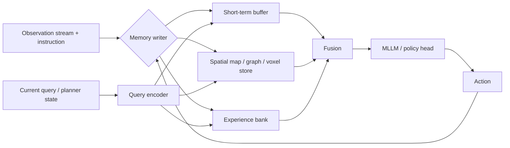
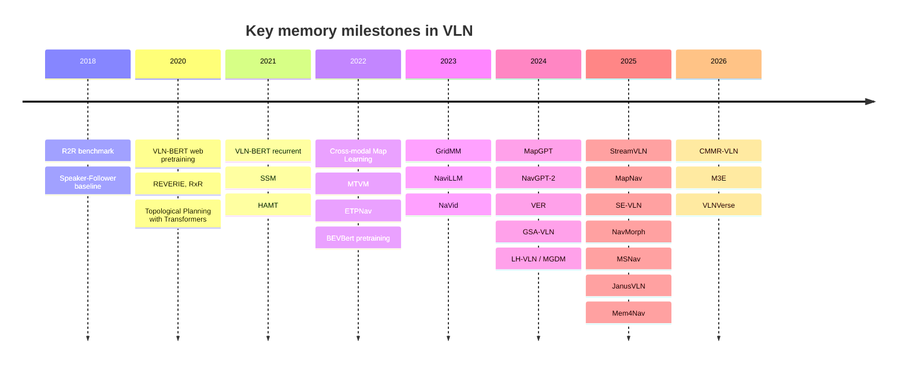

# Long-Term Memory Mechanisms for Multimodal-LLM Vision-and-Language Navigation

## Executive summary

Long-term memory in modern vision-and-language navigation (VLN) has moved well beyond keeping a short stack of recent frames. The strongest current designs fall into a few recurring families: explicit spatial memories such as topological graphs, egocentric grids, voxel maps, and annotated semantic maps; retrieval-augmented episodic memories that store past experiences and fetch only the most relevant cases; implicit neural memories that reuse transformer key/value caches or compact latent states; and hierarchical systems that split fast local memory from slower global memory. Recent MLLM/VLM-based systems such as MapGPT, StreamVLN, MapNav, SE-VLN, JanusVLN, NavMorph, MSNav, and Mem4Nav make this shift very explicit, while older but still influential precursors such as HAMT, SSM, MTVM, Topological Planning, GridMM, ETPNav, BEVBert, and VER provide the design vocabulary that most new systems still inherit. citeturn23academia10turn17view2turn17view1turn17view0turn18view1turn34view1turn16search0turn19view0turn19view5turn20view1turn20view2turn20view4turn22view2turn30search0turn22view1

For a benchmark whose goal is controlled ablation rather than one-off SOTA chasing, the most valuable additions beyond your current five options are: a **structured spatial memory** baseline, preferably both a verbal topological map and a visual semantic map; a **retrieval-augmented episodic memory** baseline; an **implicit KV-cache/latent memory** baseline; and, if budget permits, a **hierarchical indexed STM/LTM** baseline. A world-model memory track is highly promising, but it is less ablation-friendly and more entangled with training choices. Continual-learning memories are important, but they fit better as a second benchmark track with sequential-scene evaluation rather than as a drop-in replacement inside a single-episode benchmark. citeturn17view0turn23search1turn17view1turn18view1turn17view2turn19view0turn34view1turn17view5turn35view0

The engineering lesson across papers is consistent: keep the active decision context small, move old information into a typed long-term store, retrieve only a tiny task-relevant subset, and report **latency, token/memory budget, and write/read policy** in addition to SR/SPL-style task metrics. StreamVLN quantifies how fast KV memory explodes, JanusVLN shows how initial-plus-recent cache retention controls recomputation, and Mem4Nav is unusually concrete about cache sizes, ANN retrieval, and latency. citeturn18view4turn32view5turn18view0turn31view5

## Scope and assumptions

This report focuses on **memory mechanisms that are relevant to VLN systems built on multimodal large models**, especially those published or actively used from 2018 to 2025, with a few 2026 papers included only as emerging directions because they materially sharpen the taxonomy. The compute budget, base MLLM/VLM backbone, sensor stack, and deployment dataset are unspecified, so recommendations are organized by **ablation friendliness**, **integration complexity**, and **runtime cost** rather than by a single target setting. citeturn27search7turn23academia10turn24search2turn17view2turn17view1turn18view1

A second scope note matters for benchmarking: many strong “memory” papers in VLN predate MLLMs. They still belong in this discussion because recent MLLM VLN systems either directly reuse their memory structures or re-express them as prompts, tokens, caches, or latent states. In practice, the frontier is less a clean break than a re-encoding of older spatial-memory ideas into MLLM-compatible interfaces. citeturn19view5turn20view1turn20view2turn20view4turn22view2turn22view1turn23search1turn17view1turn17view2

Official or public implementations are available for several representative methods, including GridMM, VER, MapGPT, NavGPT, NaviLLM, ETPNav, Mem4Nav, and JanusVLN; MapNav states that ASM generation code and data will be released. That makes these families realistic benchmark targets rather than purely conceptual categories. citeturn5search1turn5search2turn11search0turn11search1turn11search2turn10search7turn12search1turn12search2turn17view1

## Taxonomy and representative systems

A useful way to organize VLN memory is by **what is stored**, **how it is indexed**, **when it is updated**, and **how the navigation policy queries it**. The literature now spans at least ten recognizable design families. The table below summarizes the ones most relevant to a benchmark. Representative papers are primary sources where possible.

| Method family | Representative VLN papers / code | Representation | Update policy | Query/interface to MLLM or policy | Main strengths | Main weaknesses | Typical compute / memory cost |
|---|---|---|---|---|---|---|---|
| Recurrent latent controller | VLN-BERT (Hong et al., 2021) citeturn29search4turn29search12 | Hidden recurrent cross-modal state | Synchronous every step | Implicit state in decoder/policy | Very easy to integrate; low latency | Low interpretability; history bottleneck; weak long-horizon fidelity | Low memory, low compute |
| Variable-length token memory | HAMT (Chen et al., 2021), MTVM (Lin et al., 2022) citeturn19view5turn20view2turn20view3 | Past activations / token bank | Append each step | Cross-attention over stored tokens | Better long-horizon recall than recurrent state | Memory grows with trajectory length | Moderate-to-high attention cost |
| Explicit topological graph memory | SSM (Wang et al., 2021), Topological Planning (Chen et al., 2021), ETPNav (An et al., 2023/2024) citeturn20view1turn30search3turn20view4turn20view5 | Nodes, edges, visual/geometric summaries | Add nodes/edges when new waypoints are seen | Graph search + cross-modal planner | Interpretable, good long-range planning, strong for continuous control | Needs mapping/pose consistency; more engineering | Moderate storage, moderate planning cost |
| Grid / map / voxel memory | Cross-modal Map Learning (Georgakis et al., 2022), GridMM (Wang et al., 2023), BEVBert (An et al., 2023), VER (Liu et al., 2024), OVL-MAP (Wen et al., 2025) citeturn30search1turn22view2turn22view3turn30search0turn22view1turn22view0turn30search2 | Top-down map cells, local metric maps, voxels | Project observations into map continuously | Crop/attend over map or predict waypoints from it | Strong spatial fidelity; good for global planning | Often requires depth/odometry or extra map supervision; heavier to port across backbones | Moderate-to-high memory; high preprocessing cost |
| Visual semantic map as memory replacement | MapNav (Zhang et al., 2025) citeturn17view1 | Annotated Semantic Map with textual labels | Construct at episode start, update every step | Feed map directly to a VLM instead of frame history | Very benchmark-relevant; direct replacement for raw frame history | Quality depends on map construction; integration cost higher than simple token memory | Moderate memory, moderate inference |
| Verbal or linguistic map memory | MapGPT (Chen et al., 2024), SE-VLN short-term verbal topological map citeturn23academia10turn17view0 | Textual node descriptions + topology + planner thoughts | Update as nodes/decisions accumulate | Prompted directly into LLM/VLM | Excellent interpretability; training-free variants possible | Prompt growth; text may lose visual detail | Prompt cost grows unless retrieved/compressed |
| Retrieval-augmented episodic experience bank | SE-VLN (Dong et al., 2025), CMMR-VLN (Li et al., 2026), exemplar/candidate retrieval (Gu et al., 2026) citeturn31view1turn28view0turn28view1 | Experience tuples with landmarks, images, reasoning traces, outcomes | Usually post-episode; reflection may rewrite entries | Top-k vector retrieval, then inject retrieved cases or rules into prompt | Highly ablatable; good scaling; easy to compare retrieval policies | Sensitive to key design and memory hygiene; may confound with prompt engineering | Low online cost if top-k small; storage on CPU/disk |
| Implicit KV-cache memory | StreamVLN (Wei et al., 2025), JanusVLN (Zeng et al., 2025) citeturn18view4turn18view5turn18view1turn18view0 | Transformer key/value caches or compact neural states | Incremental; often initial + sliding recent window | Native transformer attention; no explicit retrieval module | Avoids recomputation, compact relative to raw frames, fits streaming | Model-specific; less interpretable; GPU memory can spike | Low recompute but high GPU-memory pressure |
| Hierarchical indexed STM/LTM | Mem4Nav (He et al., 2025) citeturn19view0turn31view4turn31view5 | STM buffer + LTM memory tokens on octree/graph + ANN index | Sync STM per step; LTM writes indexed | Cache lookup first, then ANN/HNSW retrieve top memories | Strong scalability, explicit local/global split, practical latency reporting | Highest implementation complexity | Moderate-to-high engineering, but efficient querying |
| Learned latent world-model memory | NavMorph (Yao et al., 2025) citeturn34view0turn34view1turn34view3 | Compact latent state + contextual evolution memory | Forward-updated each step and across episodes | Planner queries latent state and predicted futures | Predictive, adaptive, compact | Harder to train and compare fairly; memory not directly inspectable | High training complexity, moderate inference |
| Continual replay / expert memory | CVLN with PerpR/ESR (Jeong et al., 2024), M3E (Jiang et al., 2026), GSA-VLN/GR-DUET (Hong et al., 2025) citeturn17view5turn35view0turn36search0turn36search2 | Replay buffer, stored logits, or expert parameters | After domains/episodes | Replay during training or route new scenes to experts | Best fit for adaptation and forgetting studies | Not a simple per-episode memory swap; needs continual protocol | Mostly training-time cost |
| External data or web memory | VLN-BERT with web image-text pretraining (Majumdar et al., 2020), RoomTour3D (Han et al., 2025), NavRAG (Wang et al., 2025) citeturn27search0turn27search8turn24search0turn15search12 | External corpora, synthetic or retrieved instruction data | Offline pretraining / data generation | Indirect via finetuning or exemplar selection | Strong generalization lever | Usually not runtime long-term memory in the strict sense | Offline data/compute heavy |

Two architecture patterns dominate the current literature. The first is **explicit memory with explicit retrieval**: write observations into a typed store, then query only the task-relevant pieces. The second is **implicit memory in the transformer itself**: retain or compress the model’s own KV/latent state so that the network can reuse history without re-encoding it. Recent VLN papers increasingly mix the two. citeturn17view0turn28view0turn17view2turn18view1turn19view0turn34view3

This “typed writer + selective retriever” pattern is visible in SSM, GridMM, MapGPT, SE-VLN, CMMR-VLN, MSNav, and Mem4Nav, even though the surface implementation ranges from graph tokens to purely textual prompts. citeturn20view1turn22view2turn23academia10turn17view0turn28view0turn18view7turn31view5

The timeline shows a clear progression: from recurrent and transformer history modeling, to explicit spatial maps, then to MLLM-friendly prompt, cache, and retrieval memories, and finally toward adaptive world models and continual expert systems. citeturn9search2turn27search0turn26view1turn9search12turn30search3turn29search4turn20view1turn19view5turn30search1turn20view2turn20view4turn30search0turn22view2turn11search2turn24search2turn23academia10turn24search1turn22view1turn36search0turn8search1turn17view2turn17view1turn17view0turn34view1turn16search0turn18view1turn19view0turn28view0turn35view0turn26view2

## Engineering patterns and trade-offs

The most important representation choice is whether memory is **spatially addressed** or merely **temporally addressed**. Recurrent states and plain token banks are temporally addressed; they remember “what came before” but not necessarily “where in the environment it lives.” Graphs, grids, semantic maps, and voxels instead let the agent query “what is near this place/landmark/route,” which is why explicit spatial memories remain so strong for long-horizon navigation. GridMM uses a dynamically growing egocentric map; Cross-modal Map Learning predicts top-down semantics with cross-modal attention; VER voxelizes the world into 3D cells and builds episodic memory over observed viewpoints; MapNav replaces historical frames with an annotated top-down semantic map. citeturn22view2turn22view3turn30search1turn30search9turn22view1turn22view0turn17view1

Indexing is the second key design axis. Current systems use at least four practical index types. Graph memory uses node IDs and shortest-path search, as in Topological Planning, ETPNav, and Mem4Nav. Map memory uses grid or voxel coordinates, sometimes aligned to the current agent heading, as in GridMM and VER. Experience memory uses semantic keys such as landmarks, trajectories, images, or learned embeddings, as in SE-VLN and CMMR-VLN. Implicit memory uses the transformer’s own KV states as the indexable substrate, as in StreamVLN and JanusVLN. Each choice changes both latency and ablation clarity. Graphs and maps are easier to inspect; KV memory is easier to make fast inside one backbone; vector databases are easiest to benchmark as fully modular add-ons. citeturn20view4turn20view5turn31view4turn22view2turn22view0turn31view1turn28view0turn18view4turn18view1

Interfaces to a multimodal LLM now fall into three broad styles. In **prompt-level memory**, the memory is textualized and appended to the prompt, which is the main design in NavGPT, MapGPT, and SE-VLN; this is highly interpretable but vulnerable to prompt growth and noisy retrieval. In **token-level memory**, memory is turned into vectors or memory tokens and fused before the policy head, as in HAMT, GridMM, VER, StreamVLN, and Mem4Nav. In **planner/controller splits**, memory is queried by a high-level planner and then handed to a lower-level controller, as in Topological Planning, ETPNav, and many continuous-environment systems. citeturn11search1turn23academia10turn17view0turn19view5turn22view2turn22view0turn17view2turn19view0turn30search3turn20view4

Scalability trade-offs are where the literature is most concrete. StreamVLN notes that a 2K-token KV cache can consume roughly 5 GB and therefore uses a sliding active window, offloads old states, discards non-observation dialogue tokens, and converts old windows into memory-token states. JanusVLN applies a hybrid **initial + sliding recent window** cache policy and explicitly reports using 8 initial frames plus 48 sliding frames. Mem4Nav pushes the modular extreme: a 128-entry STM with a 3 m spatial radius for local queries, then HNSW-based LTM retrieval over around 10K–20K indexed tokens, with end-to-end memory query latency under about 30–35 ms per decision. These are exactly the sorts of implementation details that deserve first-class status in a benchmark appendix. citeturn18view4turn32view5turn18view0turn31view5

Memory fidelity and trainability pull in opposite directions. Explicit maps preserve spatial structure but often depend on odometry, depth, segmentation, or dedicated map pretraining. Implicit memories are compact and avoid recomputation but are less interpretable and more backbone-specific. Retrieval-augmented episodic memory is comparatively easy to plug in, but its quality depends on careful key design, write policy, and repository cleaning. World-model memory is attractive because it stores **predictive** state rather than passive history, but it is also the hardest to compare fairly because success depends on latent-state modeling, rollout objectives, and adaptation mechanics beyond just memory storage. citeturn30search0turn22view1turn17view1turn18view1turn31view1turn28view0turn34view1turn34view3

A few practical engineering patterns recur often enough to be worth turning into benchmark protocol knobs. Recent systems commonly use **bounded memory** rather than unbounded append-only memory; **event-triggered writes** when a new node, object, or decisive mistake is detected; **top-k retrieval** rather than full replay; **asynchronous post-episode reflection** for long-term stores and synchronous per-step updates for short-term stores; and **selective pruning** of map nodes or tokens once they become irrelevant. MSNav explicitly prunes topological nodes by learned priority after an initial exploration phase; SE-VLN retrieves only a small few-shot subset of semantically similar experiences from a Chroma vector store; CMMR-VLN stores full successful paths but only the first crucial mistake in failed cases; MGDM deliberately blurs or pools short-term memory to forget low-confidence history. citeturn18view6turn18view7turn31view1turn28view0turn32view2

## Evaluation practice

The standard indoor VLN benchmarks remain indispensable, but they are not enough for memory research by themselves. R2R introduced the canonical indoor navigation setting in real building-scale environments, while RxR enlarged instruction diversity and trajectory length with multilingual dense grounding. REVERIE adds high-level object-centric goals and remote grounding, which is particularly revealing for semantic memory. R4R remains useful because longer paths expose history-length failure modes more clearly. citeturn9search20turn9search2turn9search12turn9search16turn26view1turn19view5

Continuous-environment and urban benchmarks are more memory-stressing than discrete indoor teleportation settings. ETPNav, NavMorph, JanusVLN, and related works center on R2R-CE and RxR-CE because continuous control magnifies the value of topological or latent memory. Outdoor street-view tasks such as Touchdown and Map2Seq, used by recent urban systems like Mem4Nav and FLAME, are especially valuable because they are longer, visually cluttered, and more dependent on persistent spatial memory than classic indoor datasets. citeturn20view4turn34view1turn18view1turn9search0turn9search4turn25search5turn25search17

Long-horizon and adaptation-specific benchmarks are now essential if the goal is to compare long-term memory designs rather than just local scene understanding. LH-VLN introduces the LHPR-VLN benchmark with 3,260 tasks averaging about 150 steps and adds ISR, CSR, and CGT to score subtask completion in multi-stage tasks. GSA-VLN changes the protocol from one-shot generalization to repeated adaptation in persistent scenes and evaluates memory-based scene retention. VLNVerse broadens this again with unified task taxonomies and physics-aware metrics such as collision rate. citeturn8search1turn8search8turn25search12turn36search0turn36search2turn26view2

For metric coverage, you should keep the classical navigation metrics—SR, OSR, SPL, NE, TL, nDTW, and where applicable SDTW—plus REVERIE’s remote grounding metrics such as RGS and RGSPL. But for memory benchmarking, that is not enough. Papers like StreamVLN and Mem4Nav make clear that you should also report **peak GPU memory**, **per-step latency**, **prompt/token count**, **retrieval latency**, **repository size**, and **write/read counts per episode**. For long-horizon settings, report subtask metrics such as ISR/CSR/CGT; for physics-aware simulators, include collision rate. citeturn26view1turn25search10turn26view2turn18view4turn31view5turn8search1

## Recommended benchmark additions

If you want a **compact but high-value benchmark suite** beyond your existing five options, I would add the following four as the core first wave.

A **structured spatial memory** baseline should come first. I would split it into two sub-variants because they test genuinely different inductive biases: a **verbal topological map** in the style of MapGPT or SE-VLN, and a **visual semantic map** in the style of MapNav. The former is maximally interpretable and prompt-friendly; the latter tests whether history can be replaced by a persistent scene representation rather than compressed token history. Both are easy to motivate scientifically, and both are highly legible in ablations. citeturn23academia10turn17view0turn17view1

A **retrieval-augmented episodic experience bank** should be the second core addition. This is probably the most benchmark-friendly family overall. It is modular, works with either LLM or VLM backbones, makes few assumptions about sensors, and gives clean knobs for ablation: what is written, when it is written, how it is keyed, whether failures are stored, which similarity function is used, and how many exemplars are retrieved. SE-VLN and CMMR-VLN are the clearest concrete references, while the 2026 exemplar-and-candidate retriever paper shows how retrieval can happen both at the episode level and the action-candidate level. citeturn31view1turn28view0turn28view1

An **implicit KV-cache memory** should be the third core addition if your base backbone exposes cache internals. This is the cleanest way to ask whether the model can remember without changing representation space at all. StreamVLN and JanusVLN demonstrate two complementary versions: one based on sliding-window + offloading + token pruning, the other based on retaining only initial and recent KV caches across separate spatial and semantic encoders. This family is valuable because it directly addresses deployment latency and recomputation costs rather than only navigation accuracy. citeturn17view2turn18view4turn18view5turn18view1turn18view0

A **hierarchical STM/LTM indexed memory** should be the fourth core addition for a more systems-oriented track. Mem4Nav is currently the clearest reference: fast local cache, slower indexed long-term store, explicit local/global retrieval modes, and unusually concrete latency reporting. This has higher integration complexity than the other three, but it is the best available picture of what a deployable long-term VLN memory might look like in practice. citeturn19view0turn31view4turn31view5

I would keep **world-model memory** as a second-wave optional track rather than a core baseline. NavMorph is compelling because it shifts memory from static recall to predictive latent state, but it entangles memory with online adaptation and dynamics modeling. In a benchmark paper, that makes attribution harder: a gain may come from better memory, better predictive regularization, or better adaptation. It is scientifically important, just not the cleanest first ablation target. citeturn34view1turn34view3turn34view2

I would also separate **continual memory** into a dedicated benchmark mode instead of mixing it into the core single-episode suite. CVLN, GSA-VLN, and M3E ask a different question: not merely “what memory helps within an episode?” but “how should an agent preserve and adapt knowledge across scenes or domains without catastrophic forgetting?” That deserves a separate protocol with sequential-scene splits and retained-performance reporting. citeturn17view5turn36search0turn35view0

## Gaps and research directions

The biggest gap in today’s literature is that **memory is often excellent, but not benchmarked as memory**. Many papers report only navigation metrics and treat the memory subsystem as architecture detail rather than an object of measurement. Very few papers systematically report write policies, repository growth, hit rate, stale-memory failure modes, prompt overhead, or GPU memory pressure. StreamVLN and Mem4Nav are positive exceptions, and future benchmarks should normalize that practice. citeturn18view4turn32view5turn31view5

A second gap is the weak distinction between **episodic memory** and **semantic memory**. Recent retrieval systems usually store full experiences or rule-like reflections, but they rarely distinguish “one past episode that resembles this case” from “persistent knowledge about rooms, objects, or user habits.” The step beyond SE-VLN and CMMR-VLN will likely be dual-memory systems that keep a case library and a distilled semantic store separately, rather than trying to serve both functions with one repository. JanusVLN’s semantic/spatial split and Mem4Nav’s local/global split point in that direction. citeturn28view0turn31view1turn18view3turn31view5

A third gap is that external retrieval is still underused at runtime. VLN has benefited from web-scale pretraining and synthetic or web-video data expansion—VLN-BERT from web image-text pairs, RoomTour3D from room-tour videos, NavRAG from retrieval-augmented instruction generation—but most deployed memory systems still retrieve only from an agent’s own past. Bringing in external scene priors, exemplars, or map statistics at test time remains relatively unexplored and is a promising research direction if carefully separated from data-scale confounds. citeturn27search0turn24search0turn15search12

A fourth direction is to import ideas from **long-video MLLMs** and **embodied VLA memory** more aggressively into VLN. MA-LMM uses an online memory bank for long video understanding, MovieChat explicitly splits rapidly updated short-term memory from compact long-term memory, TimeChat binds timestamps to frame tokens with a sliding video Q-Former, and the 2026 MEM work in robot control combines short-horizon video memory with text-based long-horizon memory. These ideas map naturally onto VLN, where the agent also consumes a long egocentric stream and needs both momentary obstacle memory and abstract task-progress memory. citeturn7search0turn7search4turn7search1turn7search13turn7search2turn7search6turn7search3turn7search15

The final promising direction is **memory quality control**: how to detect stale, redundant, or harmful memory before it pollutes decisions. Your existing options already cover sampling and clustering; the literature suggests adding **task-conditioned pruning**, **reflection-based updates**, **confidence-aware forgetting**, and **memory distillation**. MSNav prunes nodes by priority, CMMR-VLN stores only the key first mistake from failures, MGDM forgets low-confidence short-term history via pooling, and continual-learning work such as M3E suggests that not every part of a memory system should keep updating forever. citeturn18view6turn28view0turn32view2turn35view0

## Key references

The following references are the most useful anchors for a benchmark-oriented memory review.

Anderson et al., 2018, **R2R**, the canonical indoor VLN benchmark. citeturn9search20  
Qi et al., 2020, **REVERIE**, object-centric high-level VLN with remote grounding metrics. citeturn26view1  
Hong et al., 2021, **VLN-BERT**, recurrent time-aware V&L BERT for navigation. citeturn29search4  
Wang et al., 2021, **Structured Scene Memory**, explicit scene memory with collect-read controller. citeturn20view1  
Chen et al., 2021, **HAMT**, long-horizon history via hierarchical transformer encoding. citeturn19view5  
Lin et al., 2022, **MTVM**, variable-length token memory bank with memory-aware consistency loss. citeturn20view2turn20view3  
Georgakis et al., 2022, **Cross-modal Map Learning**, language-grounded egocentric semantic map prediction. citeturn30search1turn30search9  
An et al., 2023/2024, **ETPNav**, online topological mapping and planner/controller decomposition for VLN-CE. citeturn20view4turn20view5  
Wang et al., 2023, **GridMM**, dynamically growing egocentric grid map. citeturn22view2turn22view3  
An et al., 2023, **BEVBert**, map-based pretraining with local metric plus global topological maps. citeturn30search0turn30search4  
Chen et al., 2024, **MapGPT**, online linguistic map and adaptive path planning for GPT-based VLN. citeturn23academia10turn11search0  
Zhang et al., 2024, **NaVid**, video-based VLM with spatio-temporal context and no explicit maps/depth. citeturn24search2  
Zhou et al., 2024, **NavGPT-2**, large VLM navigation reasoning with policy integration. citeturn24search1turn24search13  
Liu et al., 2024, **VER**, voxelized 3D environment representation with episodic memory. citeturn22view1turn22view0turn5search2  
Song et al., 2025, **LH-VLN / MGDM**, long-horizon benchmark with ISR/CSR/CGT and dynamic memory. citeturn8search1turn32view2  
Zhang et al., 2025, **MapNav**, annotated semantic map as a substitute for frame history. citeturn17view1  
Dong et al., 2025, **SE-VLN**, hierarchical memory + RAG + reflection for self-evolving MLLM VLN. citeturn17view0turn31view1  
Wei et al., 2025, **StreamVLN**, sliding-window KV memory plus slow memory-token context. citeturn17view2turn18view4turn32view5  
Yao et al., 2025, **NavMorph**, world-model memory with Contextual Evolution Memory. citeturn34view0turn34view1turn34view3  
Zeng et al., 2025, **JanusVLN**, dual implicit memory with spatial and semantic KV caches. citeturn18view1turn18view0  
He et al., 2025, **Mem4Nav**, hierarchical STM/LTM, ANN retrieval, reversible memory tokens. citeturn19view0turn31view5turn12search1  
Jeong et al., 2024, **CVLN**, rehearsal-based continual VLN with Perplexity Replay and Episodic Self-Replay. citeturn17view5turn14search0  
Hong et al., 2025, **GSA-VLN**, persistent-scene adaptation with memory-based navigation graphs. citeturn36search0turn36search2  
Jiang et al., 2026, **M3E**, replay-free continual VLN via macro/micro expert routing. citeturn35view0  
Li et al., 2026, **CMMR-VLN**, continual multimodal memory retrieval with reflection-based updates. citeturn28view0

Assumptions used in this report: compute budget unspecified, backbone unspecified, and sensor stack unspecified. Consequently, recommendations prioritize methods that are modular, reproducible, and suitable for controlled ablations over methods that are most likely to win a single benchmark leaderboard.